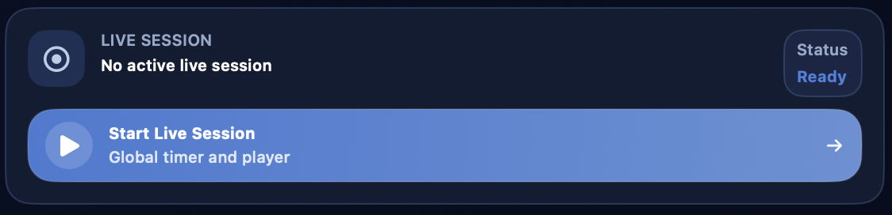

# Aventura

{ .img-hero }

A seção **Aventura** é o centro organizacional de uma campanha no DnDino. É aqui que nasce a estrutura principal do seu trabalho: o título da campanha, sua identidade visual, os personagens vinculados, as sessões, os lugares, as imagens compartilhadas, os mapas e os acessos rápidos aos combates.

!!! tip
    Pense no painel principal da aventura como o **quartel-general da campanha**: não é o lugar onde você faz tudo em detalhe, mas o ponto de onde alcança rapidamente todas as áreas realmente operacionais.

Esta página explica o fluxo principal:

- criação de uma nova aventura
- edição e gerenciamento de uma aventura existente
- funcionamento do painel principal da aventura
- relação entre o painel principal e as subpáginas dedicadas

As áreas mais específicas, como **Lugares**, **Mapas conceituais**, **Sessão ao vivo**, **Personagens**, **Imagens** e **Mapas**, serão aprofundadas em páginas próprias.

## Para que serve uma aventura

No DnDino, uma aventura é o contêiner principal de uma campanha ou de um arco narrativo. Ela reúne, dentro de um mesmo contexto:

- os personagens vinculados à campanha
- os lugares e as missões
- as sessões de texto e as sessões ao vivo
- as imagens compartilhadas
- os mapas associados aos lugares
- os mapas conceituais globais
- os combates que surgem em lugares vinculados à aventura

Assim, a aventura não é apenas uma ficha descritiva, mas o ponto de entrada para toda a parte operacional da campanha.

## Onde criar uma aventura

A criação começa na **lista de aventuras**.

A partir dessa tela você pode:

- criar uma nova aventura com o botão `Nova`
- criar a primeira aventura com o grande botão central `Criar uma aventura`, se o banco de dados ainda estiver vazio
- abrir uma aventura existente clicando na sua linha
- editar uma aventura existente
- clonar uma aventura já criada
- excluir uma aventura

A lista também pode ser ordenada por:

- nome
- data de criação
- última modificação

!!! note
    Quando você ordena por **última modificação**, o DnDino não olha apenas para a ficha da aventura, mas também para a atividade relacionada, como lugares, sessões, personagens de aventura, mapas conceituais e combates.

## Criação de uma nova aventura

Quando você abre o formulário de criação, o DnDino apresenta as informações principais da campanha.

Os campos principais são:

- `Título`
- `Autor`
- `Ambientação`
- `Descrição curta`
- `Estado`

O campo **Estado** usa um controle segmentado e permite indicar se a aventura está:

- não iniciada
- em andamento
- concluída

## Descrição ampliada

Logo abaixo das informações principais, você também encontra uma seção **Descrição** mais ampla.

Essa área serve para registrar uma apresentação mais completa da campanha, por exemplo:

- o tom da aventura
- o contexto narrativo
- os objetivos iniciais
- anotações gerais para o Mestre

A descrição longa não se perde no painel principal: se existir, ela pode ser reaberta rapidamente mais tarde.

## Capa e imagens da aventura

No formulário você pode atribuir uma **capa** à aventura. A capa é usada como imagem representativa da campanha nas telas principais.

Você também pode adicionar imagens na seção **Imagens da aventura**. Essas imagens:

- permanecem vinculadas à aventura
- não pertencem a um lugar específico
- podem ser mostradas rapidamente aos jogadores ou ao Mestre a partir do painel principal

Para cada imagem você pode gerenciar:

- nome de exibição
- visibilidade para `Jogadores`
- visibilidade para `Mestre`

## Edição de uma aventura existente

Quando você abre uma aventura existente para edição, o formulário é o mesmo da criação, mas com uma seção extra: **Redefinir aventura**.

Essa redefinição não apaga a estrutura da campanha, mas zera o estado atual de jogo. Em especial:

- remove todos os personagens de aventura vinculados
- exclui todas as sessões salvas
- devolve lugares e missões ao estado inicial
- coloca NPCs e monstros novamente com PV máximos e sem condições
- reinicia os combates preparados sem apagar sua estrutura

Essa função é útil quando você quer reutilizar a espinha dorsal de uma campanha ou devolver a aventura a um estado limpo sem reconstruí-la do zero.

## Clonagem e exclusão

Na lista de aventuras você também pode:

### Clonar uma aventura

A clonagem cria uma cópia da campanha por meio do serviço interno de duplicação. Isso é útil quando você quer:

- partir de uma estrutura parecida
- reutilizar uma configuração base
- criar uma variante de uma campanha existente

### Excluir uma aventura

Quando você exclui uma aventura, o DnDino remove o registro principal e também inicia a limpeza dos recursos vinculados. Além disso, atualiza as referências dos personagens globais para retirar a ligação com a aventura removida.

## Abrindo o painel principal da aventura

Ao clicar em uma aventura na lista, você entra no seu **painel principal**, que é o verdadeiro centro operacional da campanha.

O painel principal é organizado como uma tela em blocos:

- uma faixa superior com cabeçalho e controle da sessão ao vivo
- duas colunas inferiores com cartões dedicados às várias áreas da campanha

A ordem dos painéis pode ser personalizada nas configurações do aplicativo.

## Cabeçalho do painel principal

A parte superior do painel reúne as informações essenciais da aventura:

- capa
- título
- estado
- descrição curta
- ambientação
- autor

Se a aventura também tiver uma descrição longa, aparece um botão dedicado para abri-la em um popover e lê-la sem sair do painel.

A partir daqui você também pode entrar em **Editar** para voltar ao formulário da aventura e atualizar os dados.

## Sessão ao vivo

{ .img-shot }

Ao lado do cabeçalho fica o painel **Sessão ao vivo**.

Essa seção serve para:

- iniciar uma nova sessão ao vivo para a aventura
- ver se uma sessão está em andamento ou em pausa
- acompanhar o tempo decorrido
- pausar a sessão
- encerrá-la e salvá-la

Quando a sessão ao vivo da aventura está ativa, o **contexto global dos jogadores** e os **lugares** seguem esse contexto.

Se já existir uma sessão ao vivo aberta em outra aventura, o painel mostra isso claramente e não permite iniciar uma segunda em paralelo.

## Os painéis do dashboard

Abaixo do cabeçalho, o dashboard mostra os principais painéis da aventura.

Atualmente eles são:

- `Lugares e Missões`
- `Personagens`
- `Sessões`
- `Imagens`
- `Mapas`
- `Mapas Conceituais`
- `Estatísticas`
- `Metadados`

!!! tip
    Nas configurações, é possível alterar tanto a coluna quanto a ordem dos painéis dentro do painel principal da aventura.

### Lugares e Missões

{ .img-shot }

Este painel é o ponto de entrada para o dashboard de lugares.

A partir daqui você vê rapidamente:

- número total de lugares
- número total de missões
- número de missões concluídas

Também podem aparecer acessos rápidos para:

- o último lugar útil
- o último combate útil

Ao abrir este cartão você entra na seção que gerencia:

- lugares
- sublugares
- presenças
- imagens de lugar
- mapas
- mapas interativos
- combates vinculados aos lugares

Essa parte será descrita com mais detalhes na página dedicada a **Lugares**.

### Personagens

{ .img-shot }

O painel **Personagens** mostra os personagens vinculados à campanha.

Aqui você pode:

- ver os personagens de aventura já vinculados
- adicionar novos
- curá-los rapidamente com `Curar tudo`
- abrir o estado contextual deles dentro da campanha

Essa seção não substitui a ficha base do personagem: ela mostra a camada específica da campanha, com estado, PV e condições contextuais.

A diferença entre:

- ficha base
- personagem de aventura
- personagem de lugar
- participante de combate

será aprofundada na página dedicada a **Personagens**.

### Sessões

{ .img-shot }

O painel **Sessões** reúne:

- sessões de texto
- sessões ao vivo
- anotações
- resumos
- linha do tempo

A partir daqui você também pode criar uma nova sessão de texto. As sessões funcionam, portanto, como a memória narrativa e operacional da campanha.

Essa área será aprofundada na página dedicada à **Sessão ao vivo** e à gestão de sessões.

### Estatísticas da Aventura

O painel **Estatísticas** abre uma janela dedicada à leitura da evolução da campanha.

Essa visão reúne os combates concluídos da aventura, incluindo os que foram terminados fora de uma sessão ao vivo, e organiza tudo em ordem cronológica.

Entre os dados principais você pode encontrar:

- número total de combates
- duração média dos encontros
- duração média das sessões
- inimigos derrotados
- personagens de aventura com mais dano causado
- personagens de aventura com mais dano sofrido

Os gráficos ajudam a ler a evolução ao longo do tempo:

- dano causado por combate
- dano sofrido por combate
- dano causado por dia
- dano sofrido por dia
- duração das sessões agrupada por dia

Nos gráficos diários você pode alternar entre `Todos` e `Por personagem`. A visão por personagem usa uma linha por cada personagem de aventura envolvido; a legenda permite mostrar ou ocultar personagens individuais quando o gráfico fica cheio demais.

Os valores numéricos podem ser mostrados ou ocultados com o controle dedicado, para escolher entre legibilidade e detalhe.

!!! note
    As classificações principais de dano focam nos personagens de aventura. NPCs e monstros continuam importantes em combate, mas nas estatísticas de longo prazo teriam um peso variável demais.

### Imagens

{ .img-shot }

O painel **Imagens** reúne as imagens globais da aventura, ou seja, aquelas que não estão ligadas a um lugar específico.

A partir daqui você pode:

- adicionar imagens
- navegar por elas em páginas
- mostrá-las rapidamente aos jogadores
- mostrá-las rapidamente ao Mestre

Esta é a área certa para todo o material visual “de campanha” que não pertence a um lugar específico.

### Mapas

{ .img-shot }

O painel **Mapas** mostra todos os mapas vinculados aos lugares da aventura.

Os mapas não são adicionados diretamente aqui: eles aparecem no painel principal quando já foram ligados a um lugar.

A partir deste cartão você pode:

- navegar pelos mapas da aventura
- mostrá-los a jogadores ou ao Mestre
- abrir diretamente o mapa interativo relacionado ao lugar, se existir

Essa parte será aprofundada nas páginas dedicadas a **Mapas** e **Mapas interativos**.

### Mapas Conceituais

{ .img-shot }

O painel **Mapas Conceituais** reúne os mapas globais da aventura.

A partir daqui você pode:

- ver quantos mapas conceituais existem
- abri-los rapidamente
- criar um novo

Os mapas conceituais são úteis para ligar ideias, lugares, personagens e relações narrativas. Eles serão aprofundados na página dedicada.

### Metadados

Se a visualização de metadados estiver ativa nas configurações, também aparece um painel técnico com:

- ID da aventura
- data de criação
- data da última modificação

É uma seção útil principalmente para controle, diagnóstico ou gestão avançada.

## Relação com as subpáginas

A página **Aventura** é uma visão geral. A partir daqui, as páginas filhas aprofundam cada ferramenta operacional específica.

As subpáginas deste guia serão:

- **Lugares e Missões**
- **Mapas Conceituais**
- **Estatísticas da Aventura**
- **Imagens**
- **Mapas**
- **Mapas interativos**
- **Sessão ao vivo**
- **Personagens**

Na prática:

- esta página explica **como uma aventura nasce e como é estruturada** e como o painel principal da aventura é organizado
- as páginas filhas explicam **como cada seção interna é realmente usada**

## Quando usar esta seção

A seção Aventura é o ponto certo quando você quer:

- criar uma nova campanha
- definir a capa, o estado e a descrição da aventura
- retomar o trabalho em uma campanha existente
- entrar no painel principal
- iniciar uma sessão ao vivo
- chegar rapidamente aos lugares, personagens, sessões, imagens e mapas da campanha
- consultar estatísticas e gráficos dos combates concluídos
