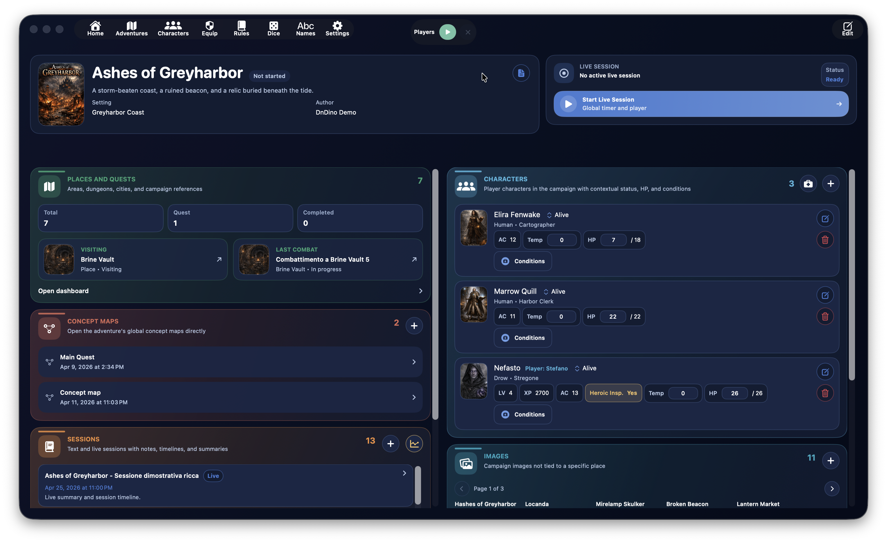
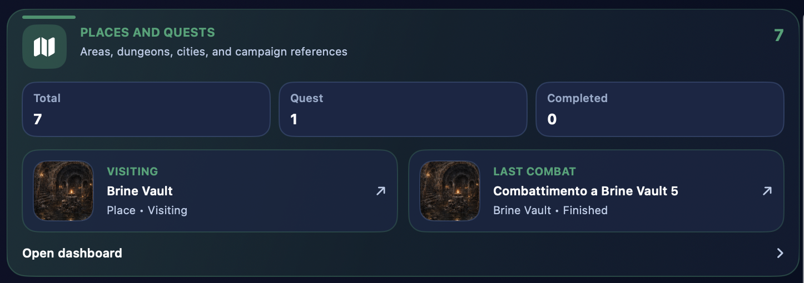
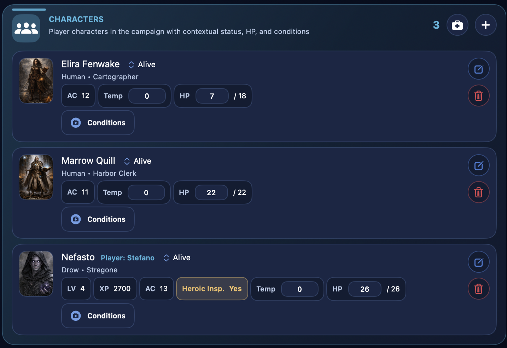
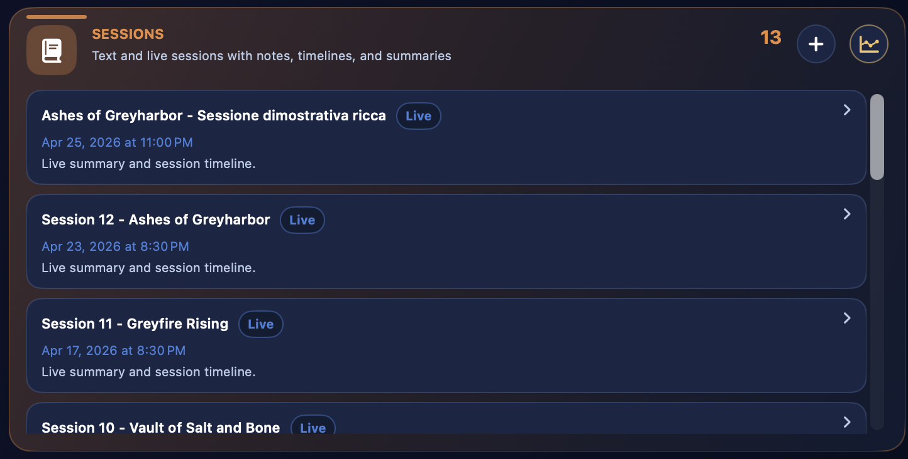
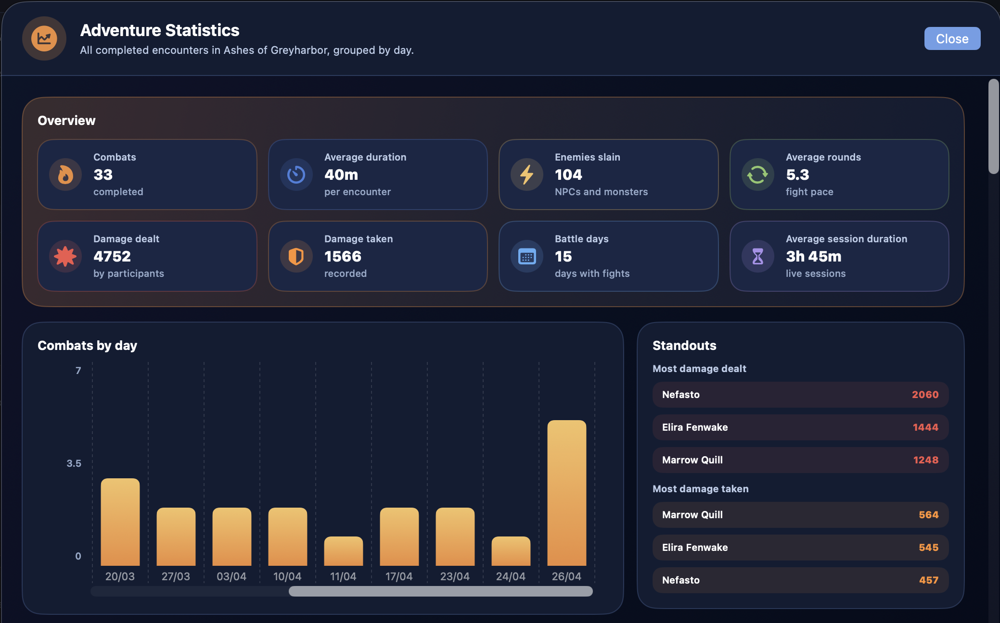
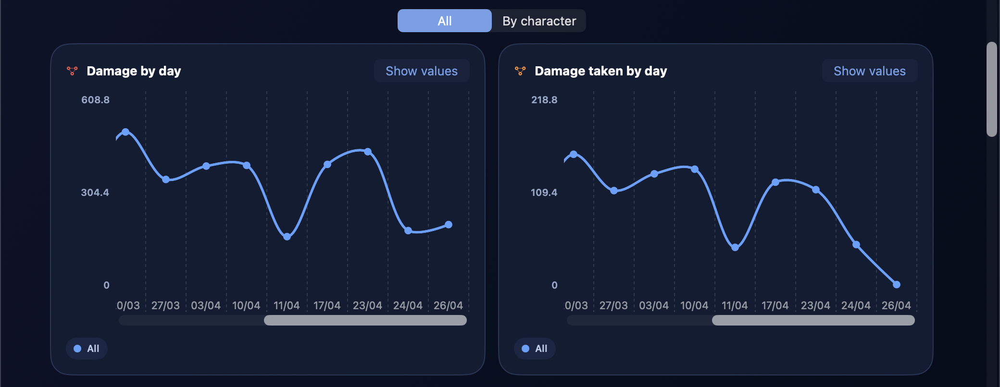
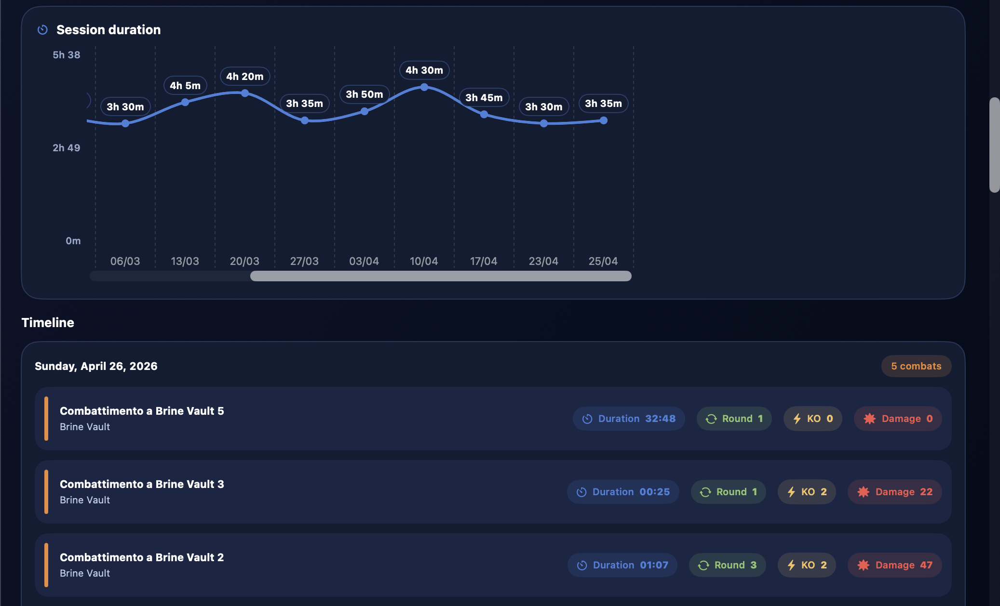
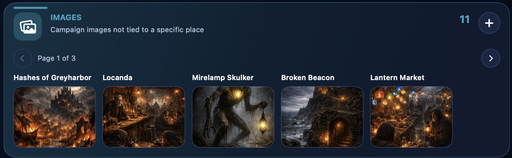
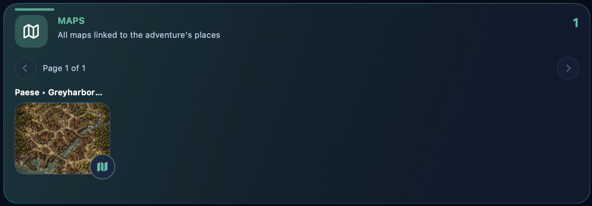
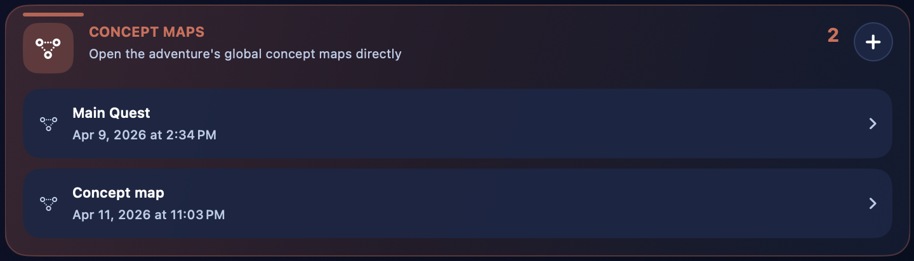

# Aventura

{ .img-hero }

A secção **Aventura** é o centro organizativo de uma campanha no DnDino. É aqui que nasce a estrutura principal do teu trabalho: o título da campanha, a sua identidade visual, as personagens associadas, as sessões, os locais, as imagens partilhadas, os mapas e os acessos rápidos aos combates.

!!! tip
    Pensa na dashboard da aventura como o **quartel-general da campanha**: não é o sítio onde fazes tudo ao detalhe, mas sim o ponto a partir do qual chegas rapidamente a todas as áreas verdadeiramente operacionais.

Esta página explica o percurso principal:

- criação de uma nova aventura
- edição e gestão de uma aventura existente
- funcionamento da dashboard da aventura
- relação entre a dashboard e as subpáginas dedicadas

As áreas mais específicas, como **Locais**, **Mapas conceptuais**, **Sessão em direto**, **Personagens**, **Imagens** e **Mapas**, serão aprofundadas nas respetivas páginas dedicadas.

## Para que serve uma aventura

No DnDino, uma aventura é o contentor principal de uma campanha ou de um arco narrativo. Serve para reunir, num único contexto:

- as personagens ligadas à campanha
- os locais e as missões
- as sessões textuais e em direto
- as imagens partilhadas
- os mapas associados aos locais
- os mapas conceptuais globais
- os combates que nascem em locais ligados à aventura

Uma aventura não é, por isso, apenas uma ficha descritiva, mas sim o ponto de entrada para toda a parte operacional da campanha.

## Onde se cria uma aventura

A criação começa na **lista de aventuras**.

A partir desse ecrã podes:

- criar uma nova aventura com o botão `Nova`
- criar a primeira aventura com o grande botão central `Criar uma aventura`, se a base de dados ainda estiver vazia
- abrir uma aventura existente clicando na respetiva linha
- editar uma aventura existente
- clonar uma aventura já presente
- eliminar uma aventura

A lista também pode ser ordenada por:

- nome
- data de criação
- última modificação

!!! note
    Quando ordenas por **última modificação**, o DnDino não olha apenas para a ficha da aventura, mas também para a atividade associada, como locais, sessões, personagens de aventura, mapas conceptuais e combates.

## Criação de uma nova aventura

Quando abres o formulário de criação, o DnDino apresenta-te a informação principal da campanha.

Os campos principais são:

- `Título`
- `Autor`
- `Ambientação`
- `Descrição breve`
- `Estado`

O campo **Estado** usa um controlo segmentado e permite indicar se a aventura está:

- por começar
- em curso
- concluída

## Descrição alargada

Por baixo da informação principal encontras também uma secção **Descrição** mais ampla.

Esta área serve para anotar uma apresentação mais completa da campanha, por exemplo:

- o tom da aventura
- o contexto narrativo
- os objetivos iniciais
- notas gerais para o Mestre

A descrição longa não se perde na dashboard: se existir, pode ser reaberta rapidamente mais tarde.

## Capa e imagens da aventura

No formulário podes atribuir uma **capa** à aventura. A capa é usada como imagem representativa da campanha nos ecrãs principais.

Também podes adicionar imagens na secção **Imagens da aventura**. Estas imagens:

- permanecem ligadas à aventura
- não pertencem a um local específico
- podem ser mostradas rapidamente aos jogadores ou ao Mestre a partir da dashboard

Para cada imagem podes gerir:

- nome visível
- visibilidade para `Jogadores`
- visibilidade para `Mestre`

## Edição de uma aventura existente

Quando abres uma aventura existente em edição, o formulário é o mesmo da criação, mas com uma secção extra: **Repor aventura**.

Esta reposição não apaga a estrutura da campanha, mas limpa o estado atual de jogo. Em particular:

- remove todas as personagens de aventura ligadas
- elimina todas as sessões guardadas
- repõe locais e missões no estado inicial
- volta a colocar NPC e monstros com os PV máximos e sem condições
- reinicia os combates preparados sem apagar a respetiva estrutura

Esta função é útil quando queres reutilizar a estrutura de uma campanha ou voltar a colocar a aventura num estado limpo sem a reconstruir de raiz.

## Clonagem e eliminação

Na lista de aventuras também podes:

### Clonar uma aventura

A clonagem cria uma cópia da campanha através do serviço interno de duplicação. É útil quando queres:

- partir de uma estrutura semelhante
- reutilizar uma configuração base
- criar uma variante de uma campanha existente

### Eliminar uma aventura

Quando eliminas uma aventura, o DnDino remove o registo principal e inicia também a limpeza dos recursos associados. Além disso, atualiza as referências das personagens globais para remover a ligação à aventura apagada.

## Abertura da dashboard da aventura

Ao clicar numa aventura da lista, entras na respetiva **dashboard**, que é o verdadeiro centro operativo da campanha.

A dashboard está organizada como um ecrã de painéis:

- uma faixa superior com o cabeçalho da aventura
- duas colunas inferiores com cartões dedicados às várias áreas da campanha

A ordem dos painéis pode ser personalizada nas definições da aplicação.

## Cabeçalho da dashboard

A parte superior da dashboard reúne a informação essencial da aventura:

- capa
- título
- estado
- descrição breve
- ambientação
- autor

Se a aventura também tiver uma descrição longa, surge um botão dedicado para a abrir num popover e lê-la sem sair da dashboard.

A partir daqui também podes entrar em **Editar** para voltar ao formulário da aventura e atualizar os respetivos dados.

## Sessão em direto

A **Sessão em direto** já não ocupa um painel fixo da dashboard: é iniciada e controlada a partir do centro da topbar quando estás dentro de uma página da aventura.

O controlo central serve para:

- iniciar uma nova sessão em direto para a aventura
- ver se uma sessão está em curso ou em pausa
- acompanhar o tempo decorrido
- colocar a sessão em pausa
- fechá-la e guardá-la

Quando a sessão em direto da aventura está ativa, o controlo continua disponível também em locais e combates, para a gerires sem voltar à dashboard.

Se já existir uma sessão em direto aberta noutra aventura, a topbar assinala-o claramente e não te deixa iniciar uma segunda em paralelo.

## Os painéis da dashboard

Por baixo do cabeçalho, a dashboard mostra os painéis principais da aventura.

Atualmente são:

- `Locais e Missões`
- `Personagens`
- `Sessões`
- `Imagens`
- `Mapas`
- `Mapas Conceptuais`
- `Estatísticas`
- `Metadados`

!!! tip
    Nas definições é possível alterar tanto a coluna como a ordem dos painéis dentro da Dashboard Aventura.

### Locais e Missões

{ .img-shot }

Este painel é o ponto de entrada para a dashboard dos locais.

A partir daqui vês rapidamente:

- número total de locais
- número total de missões
- número de missões concluídas

Também podem surgir acessos rápidos para:

- o último local útil
- o último combate útil

Ao abrir este cartão entras na secção que gere:

- locais
- sublocais
- presenças
- imagens de local
- mapas
- mapas interativos
- combates ligados aos locais

Esta parte será descrita com mais detalhe na página dedicada a **Locais**.

### Personagens

{ .img-shot }

O painel **Personagens** mostra as personagens ligadas à campanha.

Aqui podes:

- ver as personagens de aventura já associadas
- adicionar novas
- curá-las rapidamente com `Curar tudo`
- abrir o seu estado contextual de campanha

Esta secção não substitui a ficha base da personagem: mostra a camada específica da campanha, com estado, PV e condições contextuais.

A diferença entre:

- ficha base
- personagem de aventura
- personagem de local
- participante de combate

será aprofundada na página dedicada a **Personagens**.

### Sessões

{ .img-shot }

O painel **Sessões** reúne:

- sessões textuais
- sessões em direto
- notas
- resumos
- linha temporal

A partir daqui também podes criar uma nova sessão textual. As sessões são, portanto, a memória narrativa e operacional da campanha.

Esta área será aprofundada na página dedicada à **Sessão em direto** e à gestão de sessões.

### Estatísticas da Aventura

{ .img-shot }
{ .img-shot }
{ .img-shot }

O painel **Estatísticas** abre uma janela dedicada à leitura da evolução da campanha.

Esta vista reúne os combates concluídos da aventura, incluindo os que foram terminados fora de uma sessão em direto, e organiza-os cronologicamente.

Entre os dados principais podes encontrar:

- número total de combates
- duração média dos encontros
- duração média das sessões
- tempo médio dos turnos para heróis e Mestre
- inimigos derrotados
- personagens de aventura com mais dano causado
- personagens de aventura com mais dano sofrido

Os gráficos ajudam a ler a evolução ao longo do tempo:

- dano causado por combate
- dano sofrido por combate
- dano causado por dia
- dano sofrido por dia
- duração das sessões agrupada por dia
- tempo médio dos turnos, agrupado por sessão ou por combate

Nos gráficos diários podes alternar entre `Todos` e `Por personagem`. A vista por personagem usa uma linha por cada personagem de aventura envolvida; a legenda permite mostrar ou esconder personagens individuais quando o gráfico fica demasiado cheio.

Os valores numéricos podem ser mostrados ou ocultados com o controlo dedicado, para escolher entre legibilidade e detalhe. Os gráficos podem deslocar-se horizontalmente e têm controlos de zoom independentes, para expandires ou comprimires uma leitura sem afetar as outras.

!!! note
    As classificações principais de dano focam-se nas personagens de aventura. NPCs e monstros continuam importantes em combate, mas nas estatísticas de longo prazo teriam um peso demasiado variável.

### Imagens

{ .img-shot }

O painel **Imagens** reúne as imagens globais da aventura, ou seja, aquelas que não estão ligadas a um local específico.

A partir daqui podes:

- adicionar imagens
- percorrê-las por páginas
- mostrá-las rapidamente aos jogadores
- mostrá-las rapidamente ao Mestre

Esta é a zona certa para todo o material visual “de campanha” que não pertence a um único local.

### Mapas

{ .img-shot }

O painel **Mapas** mostra todos os mapas ligados aos locais da aventura.

Os mapas não são adicionados diretamente aqui: aparecem na dashboard quando já foram associados a um local.

A partir deste cartão podes:

- percorrer os mapas da aventura
- mostrá-los a jogadores ou ao Mestre
- abrir diretamente o respetivo mapa interativo do local, se existir

Esta parte será aprofundada nas páginas dedicadas a **Mapas** e **Mapas interativos**.

### Mapas Conceptuais

{ .img-shot }

O painel **Mapas Conceptuais** reúne os mapas globais da aventura.

A partir daqui podes:

- ver quantos mapas conceptuais existem
- abri-los rapidamente
- criar um novo

Os mapas conceptuais são úteis para ligar ideias, locais, personagens e relações narrativas. Serão aprofundados na página dedicada.

### Metadados

Se a visualização de metadados estiver ativa nas definições, surge também um painel técnico com:

- ID da aventura
- data de criação
- data da última modificação

É uma secção útil sobretudo para controlo, diagnóstico ou gestão avançada.

## Relação com as subpáginas

A página **Aventura** é uma visão geral. A partir daqui, as páginas filhas aprofundam cada ferramenta operacional específica.

As subpáginas deste guia serão:

- **Locais e Missões**
- **Mapas Conceptuais**
- **Estatísticas da Aventura**
- **Imagens**
- **Mapas**
- **Mapas interativos**
- **Sessão em direto**
- **Personagens**

Na prática:

- esta página explica **como nasce e como se estrutura** uma aventura e como está organizada a Dashboard Aventura
- as páginas filhas explicam **como cada secção interna é realmente usada**

## Quando usar esta secção

A secção Aventura é o ponto certo quando queres:

- criar uma nova campanha
- definir a capa, o estado e a descrição da aventura
- retomar o trabalho de uma campanha existente
- entrar na dashboard principal
- iniciar uma sessão em direto
- chegar rapidamente aos locais, personagens, sessões, imagens e mapas da campanha
- consultar estatísticas e gráficos dos combates concluídos
