# Kampf

Der Bereich **Kampf** ist DnDinos operativer Begegnungs-Tracker. Er ist schnell, kompakt und gut lesbar, wenn am Spieltisch gerade alles gleichzeitig passiert.

Ein Kampf entsteht immer aus einem **Ort** heraus und kann die Helden des Abenteuers, lokale Präsenzen, NSC und Monster dieser Szene enthalten.

Diese Seite erklärt:

- Vorbereitung vor dem Kampf
- Initiative eingeben und sortieren
- Hauptansicht des Kampfes
- Runden- und Zugsteuerung
- Angriffe, Schaden, Heilung, Zustände und Rettungswürfe
- interne Links in Angriffen und Fähigkeiten
- Seitenübersicht, letzte Ereignisse und Rückgängig-Funktion
- Spielerfenster
- Abschlussübersicht und Statistiken

## Ein oder Zwei Bildschirme

Der Kampf funktioniert auch auf **einem Bildschirm** gut: Die komplette SL-Arbeit bleibt im Hauptfenster, mit Initiative-Tracker, kompakten Datenkarten und Übersicht.

Mit einem zweiten Bildschirm kannst du zusätzlich das **Spielerfenster** nutzen:

- auf dem SL-Bildschirm bleiben Steuerung, Karten, Ziele, Zustände und Statistiken
- auf dem Spielerbildschirm erscheint eine klarere Präsentation mit Bildern und Einblendungen

!!! tip
    Ein zweiter Bildschirm ist optional. Er dient nur dazu, die technische SL-Ansicht von der stimmungsvolleren Spieleransicht zu trennen.

## Spielerfenster im Kampf

Wenn eine Begegnung startet, kann DnDino das **Spielerfenster** öffnen oder aktualisieren.

Wenn die Präsentation aktiv ist, kann sie zeigen:

- Kampfeinstieg mit Teilnehmern
- Teilnehmer am aktuellen Zug
- Angriffsanimationen
- Abschlussübersicht

{ .img-shot }

Die Einblendung kann enthalten:

- Runde
- aktuelle, maximale und temporäre TP
- Zustände
- nächster Zug

{ .img-shot }
{ .img-shot }

Für Helden/Verbündete, NSC und Monster legst du in den Einstellungen getrennt fest, welche Informationen für Spieler sichtbar sind. Wenn ein NSC oder Monster als `Verbündeter` markiert ist, wird es auch im Spielerfenster wie ein Held/Verbündeter behandelt.

## Nützliche Einstellungen

Die wichtigsten Optionen findest du in **Einstellungen**, in den Bereichen Kampf und Spielerfenster.

Wichtig sind vor allem:

- `Spielerfenster auch mit einem Monitor öffnen`
- `Spielerfenster-Steuerung in der oberen Leiste anzeigen`
- `Kampf-Intro für Spieler anzeigen`
- `Abschlussübersicht für Spieler anzeigen`
- `Runde auf Spielerbildschirm anzeigen`
- `Nächsten Zug auf Spielerbildschirm anzeigen`
- `TP der Helden auf dem Spielerbildschirm anzeigen`
- `Zustände der Helden auf dem Spielerbildschirm anzeigen`
- `TP von NSC für Spieler anzeigen`
- `Zustände von NSC für Spieler anzeigen`
- `Namen der NSC für Spieler anzeigen`
- `TP von Monstern für Spieler anzeigen`
- `Zustände von Monstern für Spieler anzeigen`
- `Namen von Gegnern für Spieler anzeigen`

Das Beenden eines Kampfes fragt immer nach Bestätigung, weil dabei Zustand und Statistiken synchronisiert werden.

## Wo der Kampf Geöffnet Wird

Ein Kampf wird aus einem **Ort** erstellt. Danach wechselt die Ansicht je nach Zustand:

- **Vor dem Kampf**: Teilnehmer, Namen und Initiative vorbereiten.
- **Aktiver Kampf**: Züge, Karten, Ziele und Übersicht verwalten.
- **Abgeschlossener Kampf**: SL-Abschlussübersicht ansehen.

## Vor dem Kampf

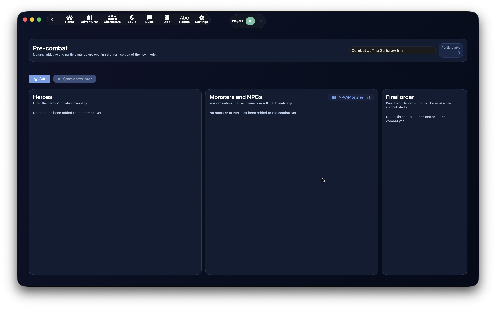{ .img-hero }

Die Vorkampf-Ansicht bereitet die Begegnung vor dem ersten Zug vor.

Sie besteht aus drei Hauptbereichen:

- **Helden**
- **Monster und NSC**
- **Endgültige Reihenfolge**

Oben siehst du außerdem Namen der Begegnung, Teilnehmerzahl und Hauptaktionen.

## Aktionen vor dem Kampf

Die Hauptaktionen sind:

- `Hinzufügen`
- `Begegnung starten`
- `NSC/Monster-Initiative`, in der Spalte Monster und NSC

`Hinzufügen` öffnet die Teilnehmerauswahl.

`Begegnung starten` startet den Kampf. Hat mindestens ein Teilnehmer Initiative `0`, fragt DnDino nach Bestätigung.

`NSC/Monster-Initiative` würfelt automatisch nur für Monster und NSC. Helden sind meist für manuelle Eingabe gedacht, weil ihre Initiative vom Tisch kommt.

## Namen und Initiative Bearbeiten

Vor dem Kampf kannst du ändern:

- angezeigter Teilnehmername
- Initiative

Das ist besonders bei Monstern praktisch, zum Beispiel:

- Goblin 1
- Goblin 2
- Goblin-Hauptmann

Die Initiative wird während der Eingabe übernommen, ohne dass das Feld den Fokus verlieren muss. Die Arbeitslisten werden beim Tippen nicht ständig neu sortiert: Die endgültige Sortierung passiert beim Start.

## Endgültige Reihenfolge

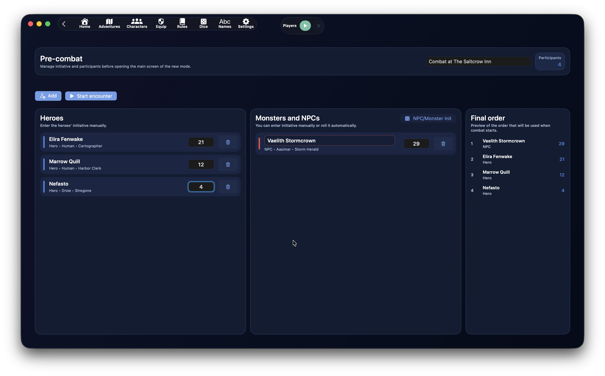{ .img-hero }

Der Bereich **Endgültige Reihenfolge** zeigt laufend die Reihenfolge, die beim Start verwendet wird.

Sortiert wird so:

1. höchste Initiative
2. bei Gleichstand höchster Geschicklichkeitsmodifikator
3. bei weiterem Gleichstand zufälliger Entscheid

So kannst du die Reihenfolge prüfen, ohne die Eingabe zu stören.

## Herkunft der Teilnehmer

Die Auswahl kann anbieten:

- `Helden`
- `Ortspräsenzen`
- `Global`

Helden, die bereits mit dem Abenteuer verknüpft sind, können in derselben Begegnung nur einmal hinzugefügt werden.

Ortspräsenzen verwenden ihren lokalen Zustand, wenn vorhanden.

Globale Monster können mehrfach hinzugefügt werden, weil sie oft mehrere Exemplare derselben Kreatur darstellen.

## Aktiver Kampf

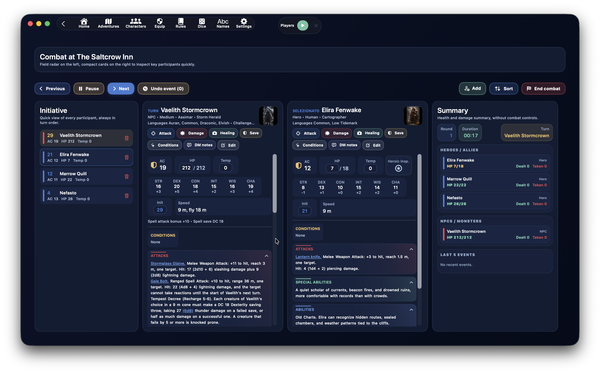{ .img-hero }

Nach dem Start wechselt DnDino in die operative Kampfansicht.

Sie ist in drei Zonen gegliedert:

- links der **Initiative-Tracker**
- in der Mitte kompakte Karten für **aktuellen Zug** und **Auswahl**
- rechts die **Übersicht** mit Gesundheit, Schaden und Ereignissen

Ziel ist, möglichst viele nützliche Informationen sichtbar zu halten, ohne große Fenster zu öffnen.

## Zugsteuerung

Die Hauptsteuerung liegt oben.

Links:

- `Zurück`
- `Pause` / `Fortsetzen`
- `Weiter`
- `Ereignis rückgängig`

Rechts:

- `Hinzufügen`
- `Sortieren`
- `Kampf beenden`

`Zurück` und `Weiter` wechseln den Zug.

`Pause` hält den Kampftimer an. In Pause wird daraus `Fortsetzen`.

`Ereignis rückgängig` stellt eines der letzten rückgängig machbaren Ereignisse wieder her.

`Hinzufügen` fügt auch während des Kampfes neue Teilnehmer hinzu.

`Sortieren` baut die Initiative-Reihenfolge neu auf.

`Kampf beenden` schließt die Begegnung nach Bestätigung.

## Initiative-Tracker

Die linke Spalte zeigt alle Teilnehmer kompakt.

Jede Zeile zeigt:

- Initiative
- Name
- RK
- TP
- temporäre TP
- Zustandsanzeige, falls vorhanden
- Rollenfarbe

Die Seitenfarbe hilft zu unterscheiden:

- Helden
- Verbündete
- Neutrale
- Gegner

Ein Klick auf eine Zeile:

- öffnet den Teilnehmer als **Auswahl**
- schließt die Auswahlspalte, wenn derselbe Teilnehmer bereits ausgewählt war

Der Papierkorb entfernt den Teilnehmer aus dem Kampf.

## Karten für Zug und Auswahl

In der Mitte können bis zu zwei Karten sichtbar sein:

- Teilnehmer am Zug
- aus der Liste ausgewählter Teilnehmer

Die Karten haben feste Breite und eigenes vertikales Scrollen, damit die Seite auch bei langen Texten stabil bleibt.

Oben auf der Karte stehen:

- Name
- Typ, Volk oder Untertyp
- Sprachen, falls vorhanden
- Herausforderungsgrad und EP, falls vorhanden
- Bildvorschau
- Aktionsknöpfe

## Schnellfelder

Direkt auf der Karte kannst du ändern:

- aktuelle TP
- temporäre TP
- Initiative

RK wird kompakt mit Schildsymbol angezeigt.

Bei Abenteurerhelden kann auch **Heldeninspiration** erscheinen.

TP-Änderungen bleiben mit linker Liste und rechter Übersicht synchron.

## Teilnehmeraktionen

Eine Karte kann zeigen:

- `Angreifen`
- `Schaden`
- `Heilen`
- `RW`
- `Zustände`
- `SL-Notizen`
- `Bearbeiten`

`Angreifen` öffnet ein Fenster mit Angreifer und Zielliste.

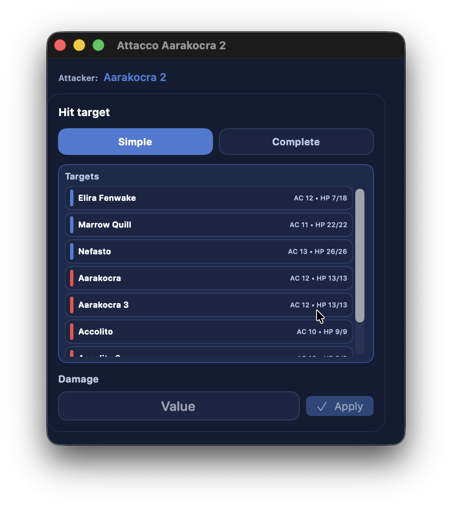{ .img-shot }

`Schaden` wendet direkten Schaden auf den Teilnehmer an.

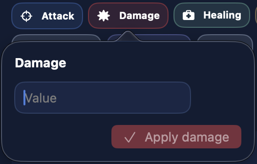{ .img-detail }

`Heilen` wendet direkte Heilung an.

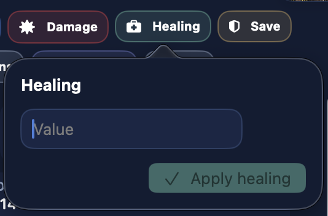{ .img-detail }

`RW` öffnet die verfügbaren Rettungswürfe.

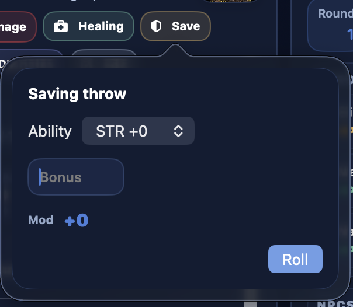{ .img-detail }

`Zustände` öffnet ein eigenes Fenster zur Zustandsverwaltung.

`SL-Notizen` speichert Notizen zum Teilnehmer. Notizen gehören nicht zur Rückgängig-Funktion.

`Bearbeiten` öffnet den vollständigen Editor.

## Ziellisten

Ziellisten werden nach Angreifer sortiert.

Wenn der Angreifer ein Gegner ist:

- zuerst Helden und Verbündete
- dann Neutrale
- dann Gegner

Wenn der Angreifer ein Held, Verbündeter oder Neutraler ist:

- zuerst Gegner
- dann Neutrale
- dann Helden und Verbündete

Innerhalb jeder Gruppe sind Namen alphabetisch sortiert.

Die farbige Seitenlinie hilft, die Rolle des Ziels zu erkennen.

## Angriffe, Fähigkeiten und Interne Links

Die Hauptbereiche sind:

- `Zustände`
- `Angriffe`
- `Besondere Fähigkeiten`
- `Fähigkeiten`
- `Zauber`
- `Beschreibung`

Die Bereiche sind einklappbar und haben einen leichten Verlauf passend zur Titelfarbe.

Texte von Angriffen, besonderen Fähigkeiten und Fähigkeiten können interne Links enthalten, die beim Erstellen oder Bearbeiten des Charakters angelegt wurden.

Im Kampf öffnen diese Links eigene Fenster, damit genug Platz zum Abwickeln der Aktion bleibt.

Die nützlichsten Links sind:

- `Vollständiger Angriff`
- `1W20 + MOD`
- freier Wurf
- Schadenswurf
- Links zu internen Einträgen

## Vollständiger Angriff

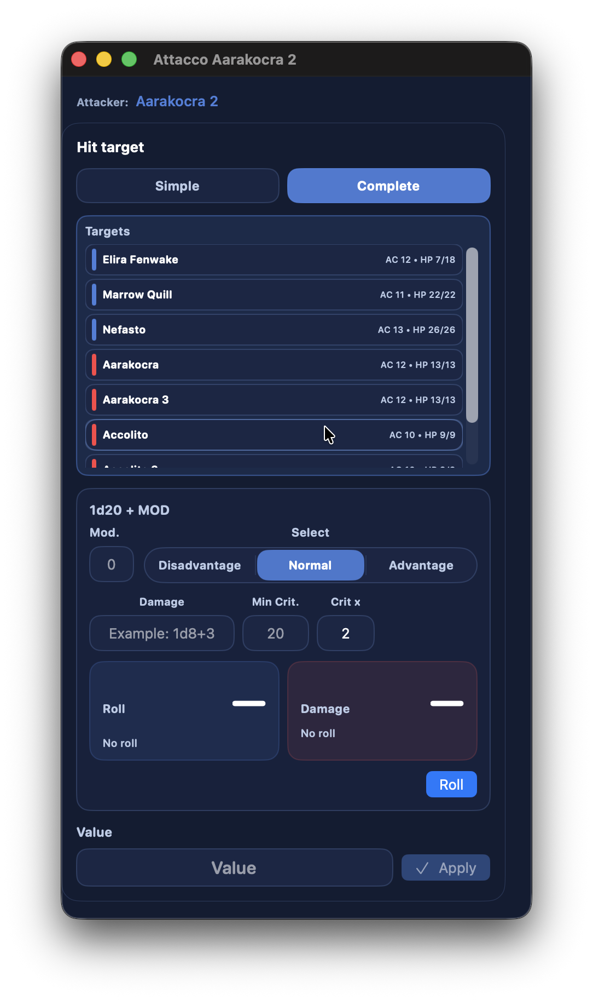{ .img-shot }
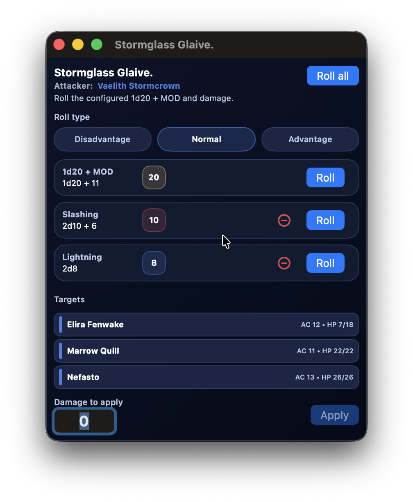{ .img-shot }

`Vollständiger Angriff` ist für Angriffstexte von Monstern, NSC oder Helden gedacht.

Du bereitest ihn im Erstellen- oder Bearbeiten-Dialog des Charakters vor: Markiere den Angriffstext und erstelle einen Link vom Typ `Vollständiger Angriff`. Im Kampf wird dieser Text zu einer vorbereiteten Aktion.

Im Kampf:

- zeigt das Fenster den Namen des Angriffs
- der Angreifer ist klar sichtbar
- du wählst ein oder mehrere Ziele
- du verwaltest mehrere Schadenszeilen
- du wendest den ausgewählten Schaden auf die gewählten Ziele an

Beim Erstellen ist der Schaden modular: Mit `+` fügst du Zeilen hinzu, angezeigt werden nur ausgefüllte Zeilen.

## Zauber

Hat der Teilnehmer Zauber, erscheint der Bereich `Zauber`.

Zauber sind nach Grad gruppiert.

Für Monster und NSC kann die Grad-Zeile auch den Verbrauchszähler zeigen, zum Beispiel:

- `0/3`
- `2/3`
- `3/3`

Der Knopf `Benutzen` beim einzelnen Zauber erhöht den Zähler dieses Grades.

Der Zähler blockiert nicht, wenn er das Maximum erreicht. Er ist nur eine Gedächtnisstütze für die SL.

Zaubertricks verbrauchen keine Plätze.

## Zustände

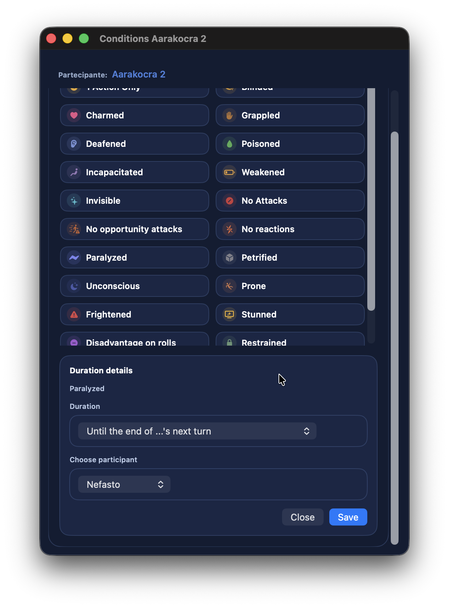{ .img-shot }

Das Fenster `Zustände` erlaubt:

- Zustände hinzufügen
- Zustände entfernen
- Dauer wählen
- Ablauf an den Zug eines Teilnehmers binden
- zugehörige Notizen verwalten

Wenn ein Zustand angewendet wird, zeigt DnDino visuelles Feedback auf dem Bildschirm und in der betroffenen Zeile.

## Helden mit 0 TP oder Weniger

Helden folgen anderen Regeln als Monster und NSC.

Ein Held kann unter `0` TP fallen.

Die Regel:

- von `0` bis `-(maximale TP - 1)` ist der Held **Bewusstlos**
- bei `-maximale TP` oder darunter stirbt er
- er stirbt auch nach 3 misslungenen Todesrettungswürfen

Wenn ein Held bei `0` TP oder darunter ist, aber nicht tot, zeigt die Karte die **Todesrettungswürfe**.

Nach 3 Erfolgen kehrt der Held auf `1` TP zurück.

## NSC und Monster mit 0 TP

Für NSC und Monster ist es einfacher:

- bei `0` TP oder weniger gelten sie als tot
- sie werden aus dem Zugzyklus entfernt
- die Übersicht kann sie als tot anzeigen

## Seitenübersicht

Die rechte Spalte zeigt die **Übersicht**.

Dort findest du:

- Runde
- Dauer
- aktuellen Zug
- Gesundheit von Helden und Verbündeten
- Gesundheit von NSC und Monstern
- verursachten Schaden
- erlittenen Schaden
- letzte 5 Ereignisse

Das ist eine Kontrollansicht: Sie dient dem schnellen Lesen, nicht dem Bearbeiten.

TP wechseln die Farbe:

- normal, wenn der Teilnehmer in gutem Zustand ist
- gelb unter 50 %
- orange unter 10 %
- rot bei 0 oder weniger

Bei Helden werden TP nur durchgestrichen, wenn der Charakter wirklich tot ist, nicht nur unter 0 TP.

## Letzte 5 Ereignisse und Rückgängig

Der Kampf behält die letzten rückgängig machbaren Ereignisse.

Dazu können gehören:

- Angriffe
- durch Angriffe angewendeter Schaden
- Heilung, wenn sie als rückgängig machbares Ereignis erfasst ist
- angewendete oder geänderte Zustände

`SL-Notizen` werden nicht rückgängig gemacht.

Rückgängig stellt auch verbundene Statistiken wieder her, damit verursachter und erlittener Schaden stimmig bleiben.

## Visuelles Feedback

Wenn im Kampf etwas passiert, zeigt DnDino sofort Feedback:

- Banner oben
- Animation auf der betroffenen Teilnehmerzeile
- Effekt auf `Anwenden`, wenn vorhanden
- Aktualisierung der Übersicht

So ist klar, dass der Befehl angekommen ist.

## Abschlussübersicht

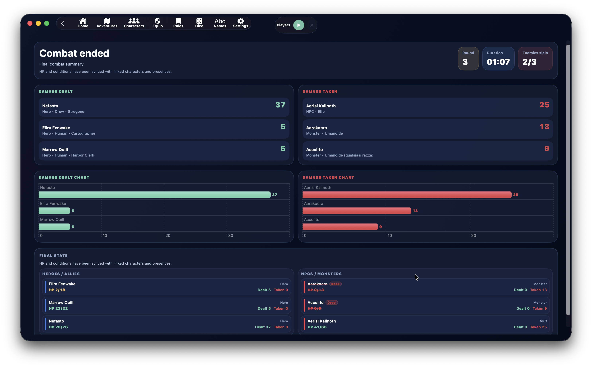{ .img-hero }

{ .img-shot }

Nach Bestätigung des Kampfendes ist die Begegnung nicht mehr bearbeitbar.

Die Abschlussansicht zeigt:

- gesamte Runden
- Dauer
- getötete Gegner
- verursachten Schaden
- erlittenen Schaden
- Endzustand der Teilnehmer

Endgültige TP und Zustände werden mit den verknüpften Einträgen synchronisiert.

## Abschlusssynchronisierung

Beim Schließen synchronisiert DnDino nötige Daten.

Für Abenteuerhelden:

- aktuelle TP
- temporäre TP
- Zustände
- Endzustand

Für Ortspräsenzen mit lokalem Zustand:

- aktuelle TP
- temporäre TP
- Zustände
- Endzustand

Der Kampf kann außerdem **Live-Sitzungsdaten** und Statistiken speisen.

## Statistiken

DnDino nutzt abgeschlossene Kämpfe für Statistiken und Diagramme.

Dazu gehören:

- verursachter Schaden
- erlittener Schaden
- Kampfdauer
- Anzahl Kämpfe
- getötete Gegner
- Schadensverlauf pro Tag
- durchschnittliche Sitzungsdauer

Im Abenteuer-Dashboard sammelt **Abenteuerstatistiken** abgeschlossene Kämpfe, auch außerhalb einer einzelnen Live-Sitzung, und gruppiert sie lesbar.

Die Live-Sitzungsübersicht kann Diagramme der in dieser Sitzung abgeschlossenen Kämpfe zeigen.

## Am Sinnvollsten

Der Kampf funktioniert am besten, wenn du:

1. die Vorkampfphase sauber vorbereitest
2. Initiative und Namen vor dem Start setzt
3. den linken Tracker nutzt, um die ganze Szene im Blick zu behalten
4. die Karte des aktuellen Zuges und bei Bedarf die Zielkarte offen hält
5. Links in Angriffen und Fähigkeiten nutzt
6. die Übersicht für Gesundheit, Schaden und Ereignisse verwendest
7. den Kampf erst beendest, wenn alles stimmt, damit Statistiken und Synchronisierung sauber bleiben

!!! tip
    Auch wenn DnDino viele Vorgänge automatisiert, kannst du weiterhin echte Würfel verwenden. Nutze den Kampf dann vor allem, um Schaden, Heilung und Zustände schnell anzuwenden, ohne TP und Statistiken ständig von Hand nachzurechnen.
