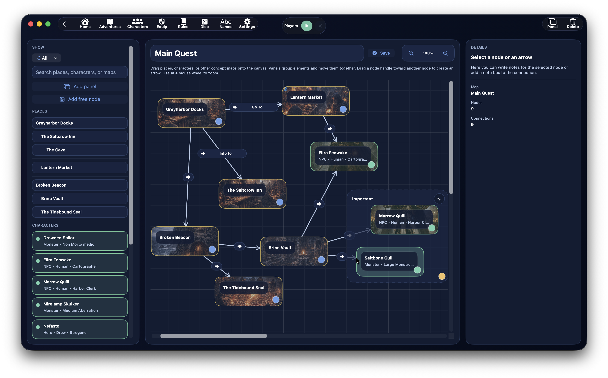

# Mapas conceptuais

{ .img-hero }

A secção **Mapas conceptuais** serve para construir uma representação visual das relações entre locais, personagens, outros mapas conceptuais e notas livres.

Não é um mapa geográfico e não é um quadro genérico: é uma ferramenta pensada para ligar os nós da campanha de forma rápida, legível e navegável.

Podes usá-la para:

- organizar a estrutura narrativa da aventura
- ligar locais e personagens
- traçar relações entre elementos importantes
- adicionar quadros temáticos
- anotar ideias diretamente em nós, quadros e ligações

## Onde se encontra

Os mapas conceptuais podem ser abertos a partir de dois pontos principais:

- a partir da **dashboard da aventura**, no painel `Mapas Conceptuais`
- a partir da dashboard de um **local**, quando queres criar ou abrir um mapa conceptual ligado a esse local

Isto significa que um mapa conceptual pode ser:

- **global da aventura**
- **ligado a um local específico**

## Estrutura do ecrã

O ecrã dos mapas conceptuais está dividido em três colunas principais:

- **barra lateral esquerda** com a palette e a lista de mapas
- **canvas central** onde constróis o mapa
- **inspector à direita** com os detalhes do elemento selecionado

## Sidebar: palette e fontes

A barra lateral esquerda reúne tudo o que podes inserir no mapa.

As principais categorias são:

- `Locais`
- `Personagens`
- `Mapas`

Além disso, podes trabalhar com:

- filtros
- pesquisa textual
- criação de quadros
- criação de nós livres

## Filtros da palette

A palette suporta um filtro dedicado com estes modos:

- `Tudo`
- `Locais`
- `Personagens`
- `Mapas`

## Pesquisa na palette

A barra de pesquisa da palette serve para encontrar rapidamente:

- um local
- uma personagem
- um mapa conceptual já existente

## O que podes arrastar para o canvas

No canvas podes arrastar:

- locais da aventura
- personagens disponíveis para a aventura
- outros mapas conceptuais
- nós livres

As personagens disponíveis na palette não são todas as personagens da base de dados sem critério: o sistema usa as personagens ligadas à aventura.

## Locais na palette

Os locais na palette são mostrados tendo em conta a hierarquia dos locais da aventura.

## Personagens na palette

As personagens mostradas na palette têm um subtítulo informativo que pode incluir:

- tipo
- raça
- classe

## Mapas na palette

A secção `Mapas` da palette mostra os outros mapas conceptuais da aventura.

Isto é especialmente útil porque um mapa conceptual pode conter um nó que aponta para outro mapa conceptual, criando uma rede de mapas ligados entre si.

## Criar um novo mapa conceptual

Podes criar um novo mapa conceptual:

- a partir da dashboard da aventura
- a partir da dashboard de um local
- diretamente a partir do ecrã de mapas conceptuais, se já estiveres a gerir um

Quando é criado, o DnDino atribui-lhe automaticamente um nome progressivo como:

- `Mapa conceptual`
- `Mapa conceptual 2`
- `Mapa conceptual 3`

## Renomear um mapa

O título do mapa ativo pode ser editado diretamente no ecrã.

Quando sais do campo ou confirmas a alteração, o DnDino guarda o novo nome do mapa.

## Eliminar um mapa

Selecionando um mapa ativo, podes eliminá-lo com o botão `Eliminar`.

## O canvas central

O **canvas** é a zona principal onde constróis o mapa.

Aqui podes:

- arrastar nós da palette
- mover os nós
- criar quadros
- ligar nós e quadros com setas
- ler a estrutura geral da campanha de relance

## Tipos de elementos no canvas

No canvas existem três famílias principais de elementos:

- **nós**
- **quadros**
- **ligações**

### Nós

Os nós representam:

- um local
- uma personagem
- um mapa conceptual
- um nó livre

### Quadros

Os quadros servem para agrupar visualmente vários nós numa área comum.

### Ligações

As ligações são setas que unem nós e quadros.

## Nós normais e nós livres

### Nós ligados a registos reais

Quando arrastas para o canvas um local, uma personagem ou um mapa conceptual, crias um nó ligado a um registo real da aplicação.

Isto significa que o nó:

- mostra o título real do elemento
- pode mostrar o subtítulo contextual
- pode abrir o registo ligado a partir do inspector

### Nó livre

O `Nó livre` é um nó especial para ideias e notas não ligadas a um registo real.

É útil para:

- anotações narrativas
- conceitos abstratos
- eventos
- grupos de ideias
- lembretes de design

## Quadros de grupo

O botão `Quadro` cria um contentor visual dentro do canvas.

Um quadro:

- tem um título
- tem uma nota dedicada
- pode ser movido
- pode ser redimensionado
- pode ser colapsado
- pode conter automaticamente os nós que fiquem dentro dele

## Como se movem os nós

Os nós podem ser arrastados livremente dentro do canvas.

A sua posição fica guardada no mapa, por isso a organização mantém-se persistente.

## Como se movem os quadros

Os quadros também podem ser arrastados.

Quando moves um quadro, o DnDino pode mover consigo os nós que fazem parte dele, mantendo o grupo legível.

## Redimensionar um quadro

Os quadros podem ser redimensionados através dos cantos.

## Colapsar um quadro

Um quadro pode ser colapsado.

Quando está colapsado:

- ocupa menos espaço
- os nós internos ficam escondidos do canvas
- as ligações dos elementos escondidos não dificultam a leitura

## Criar uma ligação

As ligações entre elementos são criadas arrastando a partir do ponto de ancoragem de um nó ou de um quadro para outro elemento compatível.

Podes ligar:

- nó → nó
- nó → quadro
- quadro → nó
- quadro → quadro

O DnDino evita:

- ligações duplicadas idênticas
- ligações de um elemento para si mesmo

## Para que servem as setas

As setas servem para representar relações, por exemplo:

- uma personagem que controla um local
- um local que leva a outro
- um mapa que aponta para um submapa
- um grupo temático ligado a um nó narrativo

O significado das setas é livre, por isso convém adotar uma convenção coerente na tua campanha.

## Inspector: detalhes do elemento selecionado

A coluna da direita muda de conteúdo conforme aquilo que selecionas.

Pode mostrar os detalhes de:

- um nó
- um quadro
- uma ligação
- ou do mapa no seu conjunto, se não tiveres nada selecionado

## Se selecionares um nó

Quando selecionas um nó, o inspector mostra:

- título
- subtítulo
- eventual botão `Abrir registo`
- descrição contextual, se disponível
- notas do nó
- botão para eliminar o nó

### Abrir o registo ligado

Se o nó estiver ligado a:

- um local
- uma personagem

podes abrir diretamente o formulário correspondente.

Se, por outro lado, o nó estiver ligado a outro **mapa conceptual**, o botão abre esse mapa e mantém também um pequeno histórico de navegação entre mapas.

### Descrição contextual do nó

Para alguns tipos de nó, o inspector mostra também uma descrição real já existente na aplicação:

- para um **local** mostra a `Descrição DM`
- para uma **personagem** mostra a descrição da personagem

### Notas do nó

Cada nó tem também notas próprias, separadas do registo de origem.

## Se selecionares um quadro

Quando selecionas um quadro, o inspector mostra:

- título do quadro
- número de elementos contidos
- notas do quadro
- botão para eliminar o quadro

## Se selecionares uma ligação

Quando selecionas uma seta, o inspector mostra:

- resumo da ligação
- nota da seta
- botão para eliminar a ligação

As notas nas ligações são muito úteis quando queres dar um significado mais preciso à relação, por exemplo:

- aliança
- dependência
- parentesco
- passagem
- causa e efeito

## Se não selecionares nada

Quando não há nenhum elemento selecionado, o inspector mostra um resumo do mapa:

- nome do mapa
- número de nós
- número de ligações

## Zoom e navegação

O ecrã suporta:

- zoom
- pan do canvas
- gestos de pinch
- uso rápido de atalhos com rato e trackpad

## Imagens nos nós

Os nós ligados a locais ou personagens podem também usar a imagem de capa do registo ligado como fundo visual.

## Mapas conceptuais ligados entre si

Uma das utilizações mais fortes do sistema é a possibilidade de ligar um mapa conceptual a outro.

Isto permite construir:

- um mapa geral da aventura
- mapas secundários para áreas específicas
- mapas especializados para personagens, fações ou subtramas

## Quando vale a pena usá-los

Os mapas conceptuais são especialmente úteis quando queres:

- planear uma campanha longa
- visualizar relações complexas
- organizar personagens e locais em blocos
- preparar subtramas
- ter uma vista estratégica que não dependa de textos longos

## Diferença em relação a Locais

A secção `Locais` organiza a aventura no plano espacial e de conteúdos.

Os **mapas conceptuais** organizam a campanha no plano relacional.

Em resumo:

- `Locais` = estrutura do mundo e conteúdos contextuais
- `Mapas conceptuais` = estrutura lógica, narrativa e relacional

## Diferença em relação aos mapas interativos

Os **mapas interativos** servem para navegar locais reais com marcadores sobre um mapa gráfico.

Os **mapas conceptuais** servem, em vez disso, para ligar conceitos, personagens, locais e ideias.

## Boas práticas

Para usar bem os mapas conceptuais, convém:

- manter um mapa geral da aventura
- criar mapas mais pequenos para áreas ou capítulos
- usar quadros para separar grupos de nós
- usar nós livres para ideias que ainda não têm uma ficha real
- anotar nós e setas com notas curtas mas úteis

## Em resumo

Os mapas conceptuais do DnDino são uma ferramenta de organização avançada.

Permitem construir uma vista visual e navegável da campanha, ligando:

- locais
- personagens
- outros mapas
- notas livres
- relações expressas com setas

!!! tip
    Se uma campanha ficar complexa, experimenta usar um mapa conceptual geral para a vista de conjunto e mapas mais pequenos para cidades, fações ou subtramas específicas. É uma das formas mais eficazes de não perder o fio.
