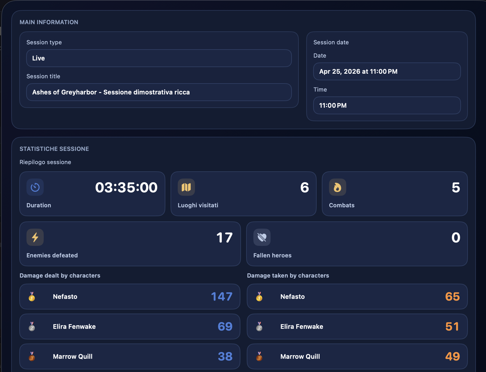
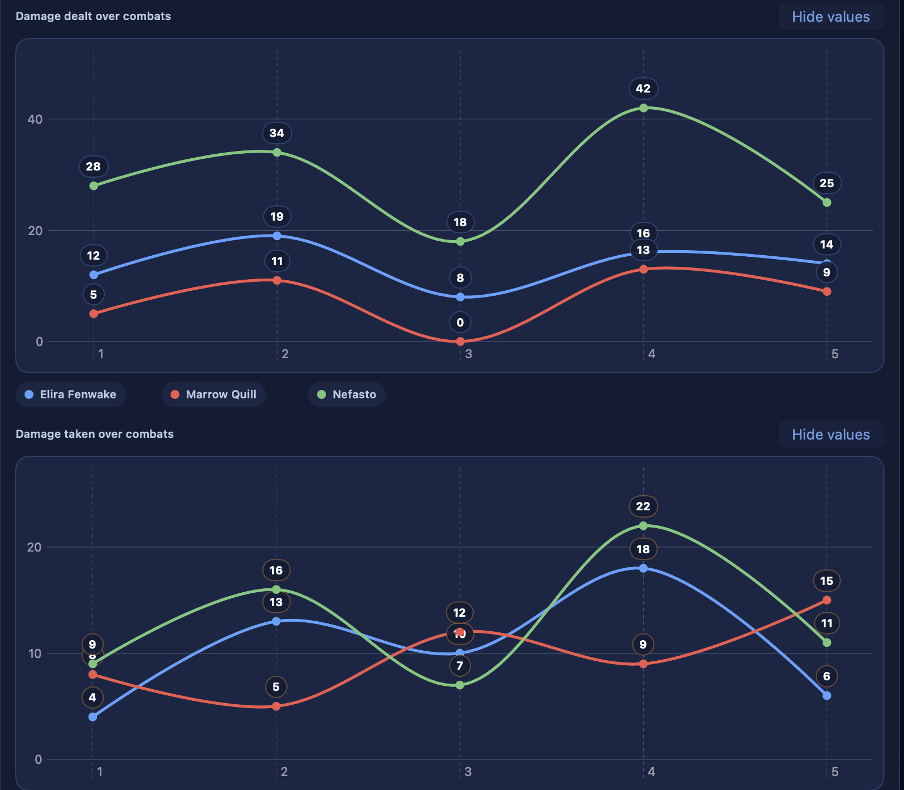

# Sesión en vivo

La **Sesión en vivo** es el contexto operativo de la partida en curso. No es simplemente un temporizador, sino un sistema que mantiene unidas:

- el tiempo de juego de la sesión
- la línea temporal de los eventos importantes
- las notas DM rápidas
- el estado de los lugares visitados
- las misiones activas o completadas
- los combates realizados
- las estadísticas agregadas de la sesión

En la práctica, cuando una sesión en vivo está activa, DnDino sabe cuál es la campaña en curso y usa ese contexto para conectar entre sí varias partes de la aplicación.

## Para qué sirve

La sesión en vivo es útil cuando quieres usar DnDino durante una sesión real en mesa, no solo en preparación.

Sirve para:

- llevar el control del tiempo de la sesión
- tener una línea temporal ordenada de los eventos principales
- anotar rápidamente información del DM
- marcar lugares en visita o ya visitados
- ver un resumen dinámico de la sesión
- recoger automáticamente los datos procedentes del combate

## Dónde se inicia

La sesión en vivo se inicia desde el **panel de aventura**, en el bloque `Sesión en vivo`.

Si no existe una sesión activa, el panel muestra:

- estado listo
- botón `Iniciar sesión en vivo`

Cuando pulsas el botón, DnDino crea una nueva sesión de tipo live y la marca como sesión global activa.

## Solo una sesión en vivo a la vez

DnDino gestiona una sola sesión en vivo activa a la vez.

Si ya hay una sesión abierta en otra aventura:

- la nueva aventura no puede iniciar una segunda
- el panel muestra un aviso indicando que la sesión activa pertenece a otra campaña

## Qué ocurre cuando una sesión en vivo está activa

Cuando una sesión en vivo está en marcha:

- la barra superior muestra su estado
- el temporizador sigue actualizándose
- los lugares siguen ese contexto
- la línea temporal empieza a recoger eventos
- el combate también puede enviar datos a la sesión

La sesión en vivo se convierte así en el hilo conductor de la partida en curso.

## Estado de la sesión

La sesión en vivo puede encontrarse en tres estados:

- activa
- en pausa
- interrumpida

### Activa

Es el estado normal mientras la sesión está en marcha. El temporizador sigue corriendo y los eventos se registran con el tiempo transcurrido correcto.

### En pausa

La sesión puede ponerse en pausa desde el panel de aventura o desde la barra superior.

Cuando está en pausa:

- el temporizador se detiene
- la sesión sigue abierta igualmente
- puede retomarse más adelante

### Interrumpida

Si la aplicación se cierra mientras la sesión sigue activa, DnDino la reabre como `interrumpida` en el siguiente inicio y registra un evento dedicado en la línea temporal.

Esto permite:

- no perder la sesión
- entender que se produjo una interrupción
- reanudar el trabajo manualmente

## El panel de Sesión en vivo en la aventura

Dentro del panel de aventura, el bloque muestra el estado actual de la sesión.

Si la sesión pertenece a la aventura abierta, el panel muestra:

- título de la sesión
- temporizador en tiempo real
- estado (`En curso` o `En pausa`)
- indicación de que el player es global
- botones:
  - `Pausa` o `Reanudar`
  - `Cerrar y guardar`

Si no hay una sesión en vivo activa:

- aparece el botón `Iniciar sesión en vivo`

Si hay una sesión activa pero pertenece a otra aventura:

- el panel muestra que la sesión en vivo está ocupada en otra parte

## La sesión en vivo en la barra superior

Cuando una sesión en vivo está activa, la barra superior de la aplicación muestra un indicador específico.

Para la descripción completa de la barra superior, consulta la página `Barra superior`.

## El panel rápido de la sesión en vivo

Desde el panel rápido de la sesión puedes hacer operaciones muy rápidas sin salir de la pantalla actual.

Aquí encontrarás:

- `Pausa` o `Reanudar`
- `Cerrar y guardar`
- editor rápido de `Nota DM`
- línea temporal de la sesión
- acciones rápidas sobre el lugar actualmente en visita
- resumen compacto de la sesión en vivo

## Nota DM rápida

En el popover de la sesión en vivo puedes escribir una **Nota DM** y añadirla de inmediato a la línea temporal.

Esto es útil para anotar al vuelo:

- decisiones de los jugadores
- ideas narrativas
- consecuencias que conviene recordar
- ideas improvisadas surgidas durante la partida

Las notas DM se registran como eventos de la línea temporal.

## Línea temporal de la sesión

La línea temporal es el registro cronológico de la sesión en vivo.

Cada evento guarda:

- título
- detalle
- momento de la sesión en el que ocurrió

La línea temporal puede contener eventos del sistema y notas DM.

## Tipos de eventos registrados

Los eventos más importantes que DnDino registra automáticamente incluyen:

- `Sesión iniciada`
- `Sesión en pausa`
- `Sesión reanudada`
- `Sesión interrumpida por cierre de la app`
- `Entrada en el lugar`
- `Salida del lugar`
- `Estado del lugar actualizado`
- `Misión activada`
- `Misión completada`
- `Combate iniciado`
- `Combate finalizado`
- `Nota DM`

## Vinculación con los lugares

La sesión en vivo está conectada directamente con los lugares de la aventura activa.

Cuando actualizas un lugar dentro del contexto de la sesión:

- el cambio de estado queda registrado
- la línea temporal se actualiza
- el resumen en vivo cambia en consecuencia

Los datos más importantes rastreados del lado de los lugares son:

- lugares en visita
- lugares visitados
- misiones activas
- misiones completadas

## Cierre automático del lugar anterior en visita

En los ajustes existe también una lógica vinculada a la sesión en vivo: cuando un lugar se marca como `En visita`, el lugar que antes estaba en visita puede marcarse automáticamente como `Visitado`.

Esta función solo se aplica cuando existe una sesión en vivo activa y es muy útil para mantener coherente el seguimiento de la exploración.

## Resumen en vivo

{ .img-shot }
{ .img-shot }

El resumen en vivo agrega los datos más importantes recogidos durante la sesión.

Entre los valores principales están:

- lugares visitados
- lugares en visita
- misiones activas
- misiones completadas
- combates realizados
- enemigos derrotados
- héroes caídos
- duración total de los combates

La sesión en vivo también mantiene dos resúmenes muy útiles para los personajes:

- daño infligido por los héroes
- daño sufrido por los héroes

## Integración con el combate

La sesión en vivo y el combate están estrechamente relacionados.

Cuando inicias un combate durante una sesión en vivo, DnDino registra:

- `Combate iniciado`

Durante el combate puede recopilar:

- datos agregados útiles para el resumen y las estadísticas

Cuando cierras el combate registra:

- `Combate finalizado`
- duración del enfrentamiento
- enemigos derrotados
- héroes caídos

## Daño infligido y daño recibido

La sesión en vivo sigue el daño a través de dos clasificaciones separadas:

- `Daño infligido por los personajes`
- `Daño recibido por los personajes`

Este recuento está pensado solo para los héroes de la aventura, no para todos los participantes del combate.

El detalle de la sesión guardada también puede mostrar gráficos de los combates concluidos durante esa sesión:

- daño infligido por combate
- daño recibido por combate

Cada combate permanece en el eje horizontal en orden cronológico. Los personajes que participaron se muestran incluso si en un combate infligieron o recibieron `0` daño, para mantener la serie coherente. Si un personaje no participa en un combate, no se añade en ese punto.

Estos gráficos ayudan a entender quién tuvo más impacto durante la sesión y quién absorbió más daño a lo largo de los encuentros.

## Héroes caídos

Cuando un combate termina, el resumen de la sesión en vivo también puede incrementar el recuento de **héroes caídos**.

Este dato se alimenta directamente del resultado final del combate.

## Sesión en vivo y Ventana de Jugadores

La sesión en vivo no coincide con la **Ventana de Jugadores**, pero ambas están conectadas.

La sesión en vivo proporciona el contexto general de la partida, mientras que la ventana de jugadores es el canal de presentación visual.

En particular:

- durante el combate la ventana de jugadores puede mostrar intro, turno actual y resumen final
- fuera del combate, la ventana de jugadores puede seguir utilizándose para mostrar imágenes y contenidos del contexto activo

## Cierre y guardado

Cuando eliges `Cerrar y guardar`, DnDino:

- finaliza la sesión
- guarda los datos recopilados
- persiste la línea temporal en la sesión vinculada a la aventura
- cierra el contexto live global

Después del cierre, la sesión sigue disponible como sesión guardada.

## Visualización de una sesión guardada

Una sesión en vivo ya finalizada puede reabrirse como vista de detalle.

En el panel de detalle encontrarás:

- resumen y línea temporal
- duración registrada
- lugares visitados
- combates realizados
- enemigos derrotados
- héroes caídos
- clasificaciones de daño infligido y recibido por los personajes
- gráficos de daño infligido y recibido en los combates de la sesión

## Cuándo conviene usar la sesión en vivo

La sesión en vivo es especialmente útil cuando quieres:

- mantener DnDino abierto durante la partida
- anotar rápidamente lo que realmente ocurre en mesa
- saber qué lugares se han visitado
- tener una línea temporal ordenada de los eventos clave
- hacer que el combate se integre automáticamente en el resumen de la sesión

## En la práctica

La sesión en vivo es el puente entre:

- preparación
- gestión operativa de la partida
- memoria final de la sesión

Bien utilizada, reduce mucho el riesgo de perder información importante durante el juego y hace mucho más fácil reconstruir después lo que realmente ocurrió en la campaña.
