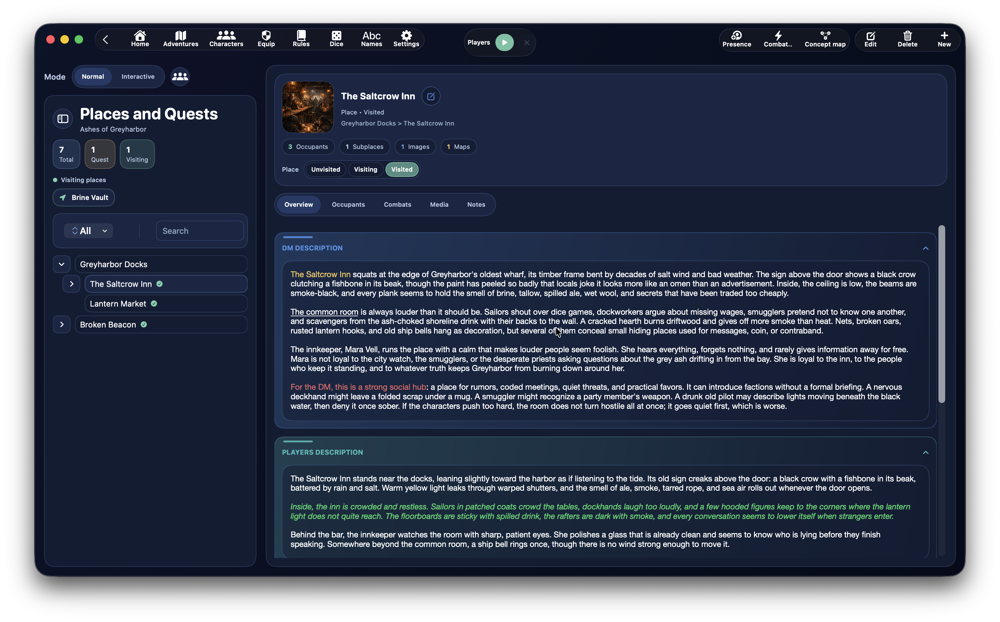
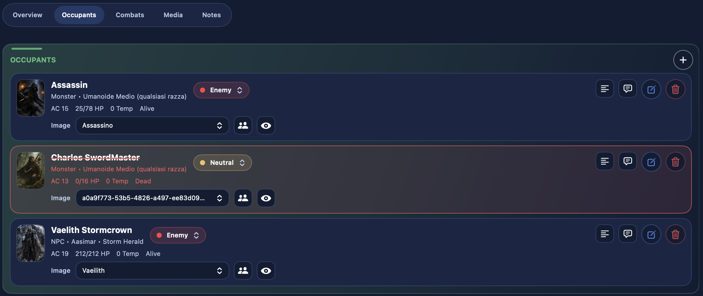
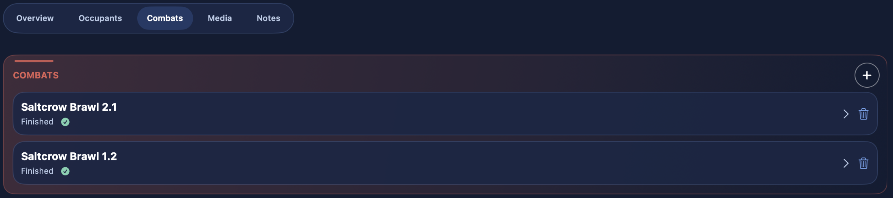
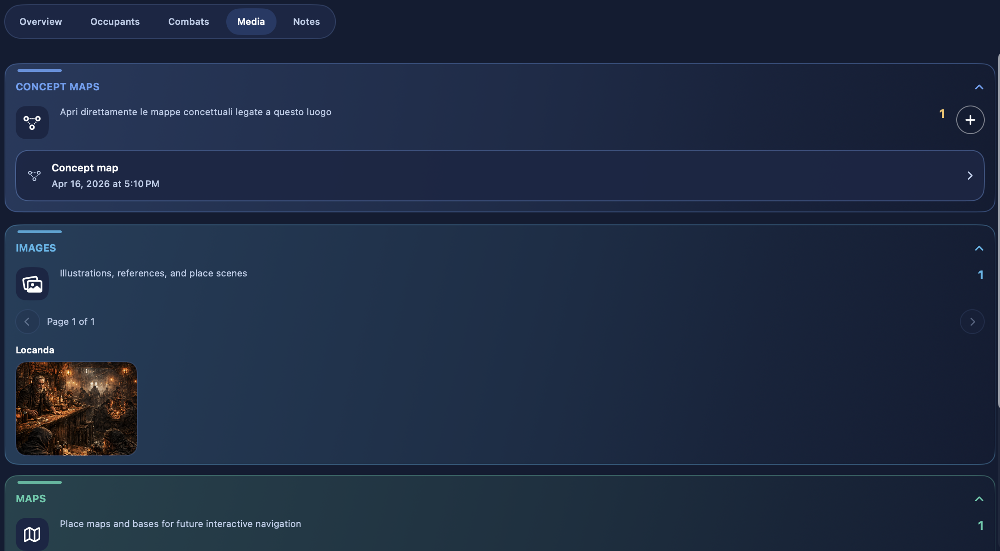
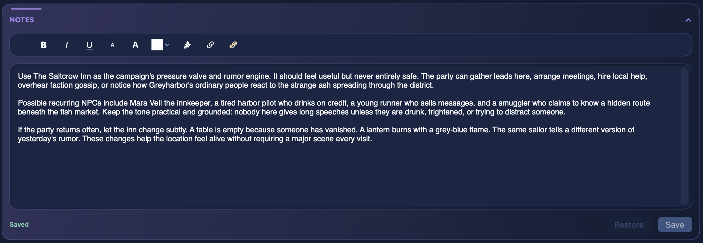

# Orte

Der Bereich **Orte** bündelt alles, was mit den bespielbaren Räumen eines Abenteuers zu tun hat: Städte, Dungeons, Räume, erzählerische Bereiche, verknüpfte Quests, Anwesende, Kämpfe, Bilder, Karten und interaktive Karten.

Er gehört zu den umfangreichsten Bereichen der App, weil er Folgendes zusammenführt:

- Erzählstruktur
- Erkundungsstatus
- Inhalte, die den Spielenden gezeigt werden
- kontextbezogene Anwesende
- schnellen Zugriff auf Kämpfe

## Wofür der Bereich Orte gedacht ist

Das Orte-Dashboard dient dazu, ein Abenteuer räumlich und erzählerisch zu organisieren.

Hier kannst du:

- Orte und Quests erstellen
- Hierarchien aus Orten und Unterorten aufbauen
- Bilder und Karten verknüpfen
- Anwesende an einem Ort verwalten
- Kämpfe erstellen und wieder öffnen, die an einen bestimmten Ort gebunden sind
- getrennte Beschreibungen für SL und Spielende pflegen
- eine interaktive Karte nutzen, um zwischen Orten zu navigieren

## Wie man dorthin gelangt

Der Bereich wird über das **Abenteuer-Dashboard** geöffnet, über die Karte `Orte und Quests`.

Von dort aus kannst du:

- das komplette Orte-Dashboard öffnen
- vorhandene Schnellzugriffe zu einem zuletzt genutzten Ort verwenden
- vorhandene Schnellzugriffe zu einem zuletzt genutzten ortsgebundenen Kampf verwenden

## Aufbau des Bildschirms

Das Dashboard `Orte` ist um zwei Hauptmodi aufgebaut:

- `Normal`
- `Interaktiv`

und in zwei Hauptbereiche gegliedert:

- eine **linke Spalte** mit Baum, Suche, Filtern und Schnellaktionen
- ein **rechtes Panel** mit den Details des ausgewählten Ortes

## Normaler und Interaktiver Modus

### Normaler Modus

{ .img-hero }

Das ist der klassische Modus, gedacht für die direkte Arbeit an:

- dem Ortsbaum
- den Details des ausgewählten Ortes
- Anwesenden
- Kämpfen
- Medien
- Notizen

Er ist der beste Modus, um das Abenteuer vorzubereiten und zu bearbeiten.

### Interaktiver Modus

{ .img-hero }

Der Modus `Interaktiv` wird verfügbar, wenn es im Abenteuer nutzbare interaktive Karten gibt.

In diesem Modus verlagert sich der Fokus auf die Navigation über Karten:

- die linke Bildschirmseite zeigt die interaktive Karte statt des klassischen Ortsbaums
- Marker können ausgewählt werden
- per Doppelklick lässt sich der verknüpfte Ort im rechten Panel öffnen
- die Namen der Marker können ein- oder ausgeblendet werden
- Zoom und Verschieben der Karte stehen zur Verfügung

Über den Bereich `Medien` kannst du weiterhin schnell die interaktive Karte öffnen, die einer Ortskarte zugeordnet ist, aber im Modus `Interaktiv` wird die Karte zum Hauptinhalt der linken Seite des Dashboards.

## Die linke Spalte

Die linke Spalte ist das Navigationspanel dieses Bereichs.

Hier findest du:

- Suche
- Filter
- eine kompakte Zusammenfassung
- den Baum aus Orten und Quests

### Kontextmenü auf Orten im Baum

Im Baum-Modus kannst du **mit der rechten Maustaste auf einen Ort klicken**, um ein Kontextmenü mit Schnellaktionen direkt auf diesem Knoten zu öffnen.

Verfügbare Aktionen sind:

- `Unterort hinzufügen`
- `Präsenz hinzufügen`
- `Verknüpfung hinzufügen`
- `Verknüpfung entfernen`
- `Beziehungsdiagramm erstellen`
- `Kampf erstellen`
- `Bearbeiten`
- `Ort löschen`

Dieses Menü ist einer der schnellsten Wege, die Struktur des Abenteuers direkt im Baum aufzubauen.

In der Praxis kannst du damit den Baum schnell umorganisieren, ohne jedes Mal das vollständige Ortsformular zu öffnen.

### Schnelles Umordnen per Drag-and-drop

Der Ortsbaum unterstützt außerdem einen schnellen Drag-and-drop-Workflow.

Du kannst:

- die Reihenfolge von Geschwisterorten ändern
- einen Ort unter einen anderen Ort verschieben
- einen Ort zurück in die Wurzel verschieben, wenn du ihn aus einem Elternzweig herausziehst

So lässt sich die narrative Struktur bei der Vorbereitung sehr schnell verfeinern.

### Filter und Zusammenfassung

Die Seitenleiste zeigt außerdem eine kompakte Zusammenfassung mit:

- Gesamtzahl der Orte
- Anzahl der Quests
- Anzahl der gerade besuchten Orte

Je nach Modus und Kontext können Filter enthalten:

- alle
- Orte
- Quests
- in Besuch
- aktiv

## Einen Ort oder eine Quest erstellen

Um einen neuen Eintrag anzulegen, verwendest du die Erstellen-Schaltfläche im Orte-Dashboard.

Das Formular ist in drei Hauptgruppen unterteilt:

- `Hauptinformationen`
- `Beschreibungen`
- `Orts-Assets`

## Hauptinformationen des Ortes

Im Formular kannst du ausfüllen:

- `Name`
- übergeordneter Ort oder Verknüpfungen zu übergeordneten Orten
- `Typ`
- `Markierung`
- Ortsstatus oder Queststatus

### Typ: Ort oder Quest

Im Feld `Typ` wählst du, ob der Eintrag ein:

- `Ort`
- `Quest`

ist.

Wenn der Eintrag ein **Ort** ist, verwendet er den Besuchsstatus:

- nicht besucht
- in Besuch
- besucht

Wenn der Eintrag eine **Quest** ist, verwendet er stattdessen den Fortschrittsstatus:

- inaktiv
- nicht verfügbar
- aktiv
- abgeschlossen

## Übergeordnete Orte und Hierarchie

Das Ortsformular unterstützt eine erweiterte Hierarchie.

Du kannst einen oder mehrere übergeordnete Orte auswählen, und DnDino speichert diese Verbindung als echte Hierarchiestruktur.

Das bedeutet, ein Ort kann:

- an der Wurzel des Abenteuers liegen
- als Unterort eines anderen Ortes existieren
- bei Bedarf an mehreren Stellen der Struktur verknüpft sein

Das ist zum Beispiel nützlich, wenn du:

- eine ganze Gruppe von Orten unter eine Quest hängen willst
- denselben Ort in mehreren Zweigen des Baums zeigen möchtest
- verschiedene Erzählpfade aufbauen willst, ohne den Datensatz zu duplizieren

In diesen Fällen wird der Ort **nicht dupliziert**: Im Baum wird nur eine zusätzliche Verknüpfung zum selben Ort angelegt.

Wenn du eine Verknüpfung entfernst:

- wird der Ort selbst nicht gelöscht
- bei mehreren Eltern wird nur die zusätzliche Verknüpfung entfernt
- verliert der Ort seinen einzigen Elternteil, kehrt er an die Wurzel des Baums zurück

Das Formular verhindert trotzdem Zyklen, indem es den Ort selbst und seinen Unterbaum automatisch aus der Liste möglicher Eltern ausschließt.

## Ortsmarkierungen

Jeder Ort kann eine oder mehrere besondere Markierungen haben, die ebenfalls im Dashboard angezeigt werden.

Verfügbare Markierungen sind unter anderem:

- gefährlich
- wichtig
- geheim
- blockiert

Sie dienen als schnelle visuelle Hervorhebung, damit du das Abenteuer auf einen Blick besser lesen kannst.

## Ortsbeschreibungen

Der Bereich `Beschreibungen` des Formulars ist in mehrere Rich-Text-Felder unterteilt:

- `SL-Beschreibung`
- `Spielerbeschreibung`
- `Hinweise`
- `Schätze`
- `Notizen`

Diese Aufteilung ist sehr nützlich, weil sie dir erlaubt, zu trennen:

- was die Spielleitung wissen sollte
- was die Spielenden sehen oder entdecken dürfen
- unterstützende Informationen wie Hinweise und Schätze

## Interne Links in Ortstexten

Das System der **internen Links** ist auch im Bereich `Orte` sehr nützlich.

Hier geht es weniger darum, Angriffe zu automatisieren, sondern vielmehr darum, Ortstexte **navigierbar** und am Spieltisch schneller nutzbar zu machen.

In den Rich-Text-Feldern eines Ortes kannst du Links einfügen zu:

- `Charakter`
- `Ort`
- `Zauber`
- `Talent`
- `Regel`
- und bei Bedarf auch zu Würfelwürfen

### Warum sie in Orten wichtig sind

Ortsbeschreibungen enthalten oft viele Verweise:

- anwesende oder erwähnte Charaktere
- verknüpfte Orte
- im Text genannte Gegenstände oder Zauber
- besondere Szenenregeln

Wenn du diese Verweise in interne Links verwandelst, kannst du:

- sofort den Bogen eines erwähnten Charakters öffnen
- direkt zu einem anderen Ort im Abenteuer springen
- einen Zauber oder eine Regel nachschlagen, ohne den Kontext zu verlassen
- dichtere Beschreibungen schreiben, die trotzdem leicht navigierbar bleiben

### Praktische Beispiele

Du kannst einen im Ort erwähnten Charakter verlinken, etwa `Kapitän Arven`, oder einen anderen im Text erwähnten Ort, wie die `Versunkene Krypta`.

Dadurch ist die Beschreibung nicht mehr nur erzählerisch, sondern wird auch zu einer Navigationsabkürzung.

### Wo sie am sinnvollsten sind

Die besten Bereiche eines Ortsbogens für interne Links sind:

- `SL-Beschreibung`
- `Spielerbeschreibung`
- `Hinweise`
- `Notizen`

### Anfangssuche im Picker

Wenn du auf `Link` klickst, versucht der Picker, den markierten Text als Anfangsfilter zu verwenden.

Findet er einen echten Treffer im Namen eines Eintrags:

- wird er bereits gefiltert geöffnet

Findet er keine echten Ergebnisse:

- wird der Anfangsfilter geleert
- und die komplette Liste angezeigt

## Orts-Assets

Jeder Ort kann eigene Assets haben, aufgeteilt in:

- Bilder
- Karten

Im Formular kannst du:

- Bilder hinzufügen
- Karten hinzufügen
- das Titelbild des Ortes auswählen
- das Titelbild entfernen

Für jedes Asset kannst du festlegen:

- Anzeigename
- Sichtbarkeit für `Spielende`
- Sichtbarkeit für `Spielleitung`
- Präsentationstext

## Hero-Bereich des Ortes

Wenn du einen Ort auswählst, zeigt das rechte Panel einen Hero-Bereich mit:

- dem Titelbild des Ortes
- dem Namen
- dem Typ (`Ort` oder `Quest`)
- dem aktuellen Status
- eventuellen Markierungen
- der Hierarchiekette des Ortes

Zusätzlich erscheint eine Schnellübersicht mit:

- `Anwesende`
- `Unterorte`
- `Bilder`
- `Karten`

## Detail-Tabs

Das rechte Panel nutzt eine Fokusleiste mit fünf Hauptbereichen:

- `Überblick`
- `Anwesende`
- `Kämpfe`
- `Medien`
- `Notizen`

### Überblick

Der Tab `Überblick` bündelt:

- SL-Beschreibung
- Spielerbeschreibung
- Hinweise
- Schätze
- mit dem Ort verknüpfte Beziehungsdiagramme

### Anwesende

{ .img-shot }

Der Tab `Anwesende` zeigt die Charaktere, die sich an diesem Ort befinden.

Von hier aus kannst du:

- alle Anwesenden des Ortes sehen
- einen neuen Anwesenden hinzufügen
- die kontextbezogenen Details dieses Anwesenden öffnen
- seine Rolle am Ort ändern
- `SL-Notizen` lesen oder bearbeiten
- den Anwesenden entfernen

### Kämpfe

{ .img-shot }

Der Tab `Kämpfe` zeigt alle Auseinandersetzungen, die mit diesem Ort verknüpft sind.

Von hier aus kannst du:

- einen neuen Kampf für den Ort erstellen
- einen vorhandenen Kampf erneut öffnen
- sehen, ob er nicht gestartet, pausiert oder beendet ist
- einen Kampf löschen

### Medien

{ .img-shot }

Der Tab `Medien` bündelt:

- Ortsbilder
- Ortskarten
- geerbte Karten übergeordneter Orte, wenn sie aktiviert sind

Von hier aus kannst du:

- Bilder durchsuchen
- Karten durchsuchen
- sie den Spielenden zeigen
- sie der Spielleitung zeigen
- direkt eine interaktive Karte öffnen

### Notizen

{ .img-shot }

Der Tab `Notizen` ist den schnellen Notizen der Spielleitung für diesen Ort gewidmet.

## Anwesende an einem Ort

Anwesende eines Ortes werden kontextbezogen und getrennt von Abenteuercharakteren und Kampfteilnehmenden verwaltet.

Dadurch kannst du behalten:

- kontextbezogene Anzeigenamen
- die Rolle am Ort
- lokale SL-Notizen
- bei Bedarf einen lokalen Zustand

## Zwei mögliche Ursprünge für einen Anwesenden

Wenn du einem Ort einen Anwesenden hinzufügst, fragt das Formular nach dem `Ursprung`.

Mögliche Quellen sind:

- `Abenteuercharakter`
- `Grundbogen`

### Abenteuercharakter

Dieser Ursprung verwendet einen Charakter, der bereits mit dem Abenteuer verknüpft ist.

In diesem Fall behält der Anwesende den kampagnenspezifischen Zustand.

### Grundbogen

Dieser Ursprung klont einen Basiseintrag des Typs:

- `NSC`
- `Monster`

Einträge vom Typ `Held` sind in diesem Modus nicht auswählbar.

## Eindeutigkeitsregeln für Anwesende

Im Orte-Dashboard wendet DnDino genaue Regeln an:

- ein `Abenteuercharakter` kann am selben Ort nur einmal platziert werden
- ein grundlegender `NSC` kann am selben Ort nur einmal hinzugefügt werden
- ein grundlegendes `Monster` kann am selben Ort mehrfach hinzugefügt werden

Wenn du mehrere Instanzen desselben Monsters hinzufügst, wird der Anzeigename automatisch nummeriert, zum Beispiel:

- `Goblin`
- `Goblin 2`
- `Goblin 3`

## Daten eines Anwesenden am Ort

Im Formular für Anwesende kannst du einstellen:

- `Begegnungsrolle`
- `Anzeigename`
- `Zustände`
- `SL-Notizen`

Wenn der Anwesende aus einem **Grundbogen** (`NSC` oder `Monster`) stammt, bekommst du zusätzlich einen lokalen Ortszustand wie:

- temporäre TP
- aktuelle TP
- Status

Wenn der Anwesende aus einem **Abenteuercharakter** stammt, verweist der Ort weiterhin auf diesen kampagnenspezifischen Kontextzustand, statt ihn auf dieselbe Weise lokal zu duplizieren.

## Rolle am Ort

Jeder Anwesende hat eine kontextbezogene Rolle:

- Verbündeter
- neutral
- Feind

Diese Rolle ist sowohl für das Lesen der Szene als auch für spätere Abläufe, etwa Kämpfe, wichtig.

## Mit dem Ort verknüpfte Kämpfe

Kämpfe innerhalb von Orten werden direkt aus dem ausgewählten Ort heraus erstellt.

Wenn du einen neuen Kampf erstellst:

- wird der Kampf als Begegnung dieses Ortes gespeichert
- erscheint er sofort im Tab `Kämpfe`
- kann er später wieder geöffnet werden

## Medien des Ortes

Der Medienbereich eines Ortes unterscheidet klar zwischen:

- Bildern
- Karten

Das Dashboard kann auch Karten übergeordneter Orte über den Schalter anzeigen:

- `Karten übergeordneter Orte anzeigen`

## Interaktive Karte

Wenn eine Karte als interaktive Karte des Ortes ausgewählt wurde, kannst du sie direkt aus dem Dashboard öffnen.

Die interaktive Karte unterstützt:

- Zoom
- Verschieben
- Marker
- Navigation zwischen Orten

### Marker der interaktiven Karte

Jeder Marker kann haben:

- eine Position auf der Karte
- einen Titel
- einen verknüpften Zielort

Marker können:

- erstellt
- verschoben
- umbenannt
- mit einem Ort verknüpft
- gelöscht

Grundverhalten:

- einfacher Klick: Marker auswählen
- Doppelklick: verknüpften Ort im rechten Panel öffnen

## Beziehung zwischen Orten, Karten und interaktiven Karten

Es hilft, diese drei Dinge als unterschiedliche Ebenen zu betrachten:

- der **Ort** ist der erzählerische und strukturelle Container
- die **Karte** ist ein visuelles Asset, das mit dem Ort verknüpft ist
- die **interaktive Karte** ist eine ausgewählte navigierbare Karte, angereichert mit Markern

## Quests im Bereich Orte

Quests leben im selben Bereich wie Orte, folgen aber ihrem eigenen Verhalten.

Eine Quest:

- erscheint im Baum neben den Orten
- verwendet einen Fortschrittsstatus statt eines Besuchsstatus
- kann trotzdem Beschreibungen, Notizen, Bilder, Karten, Anwesende und kontextbezogene Links haben

## Wann man den Bereich Orte nutzt

Das Dashboard `Orte` ist die richtige Stelle, wenn du:

- die Geografie der Kampagne aufbauen möchtest
- Unterorte und Verknüpfungen definieren willst
- Quests und ihren Status vorbereiten möchtest
- Anwesende in der Welt platzieren willst
## Ergänzungen in Version 1.4

Die Orte-Dashboard enthält jetzt auch den Modus `Schatten`, wenn im Abenteuer Schattenkarten vorhanden sind.

Der Modus zeigt eine Schattenkarte links in der Orte-Seite und erlaubt dem Spielleiter, die Karte während der Runde schrittweise aufzudecken. Du kannst Anmerkungen zeichnen, Pfeile setzen, Anmerkungen löschen ohne den Nebel zu verändern, Bereiche mit Kreis- oder Rechteckwerkzeugen aufdecken und die Karte im Spielerfenster anzeigen oder aktualisieren.

Karten können jetzt getrennt als `Interaktive Karte` und `Schattenkarte` markiert werden. Eine Karte ohne Markierung bleibt weiterhin in den Medien des Ortes sichtbar, zeigt aber keine speziellen Befehle für interaktive Karten oder Schattenkarten.

Ortsmedien können außerdem über die macOS-Teilen-Funktion geteilt werden.
