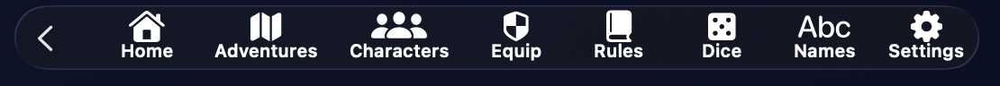

# Topbar

{ .img-hero }

La **topbar** est la zone de raccourcis globale de DnDino. Elle garde à portée de main les outils utilisés le plus souvent pendant la préparation ou la session.

Elle peut afficher seulement les icônes, ou les icônes avec leur nom, selon le réglage choisi dans **Réglages**.

## Comportement Général

Les boutons de gauche sont des raccourcis globaux. Certains ouvrent une section complète, d'autres ouvrent un panneau rapide pour consulter une information sans quitter l'écran courant.

## Accueil

`Accueil` ramène à la page de départ de l'application.

Utilise-le pour revenir à la vue générale ou repartir depuis l'entrée principale.

## Aventures

`Aventures` change de comportement selon le contexte.

Depuis l'**Accueil** ou une section qui n'est pas liée à une aventure précise, il ouvre la liste des aventures.

Depuis un **tableau de bord d'aventure**, les **lieux** ou un **combat** lié à une aventure, il ramène au tableau de bord de cette aventure.

## Personnages

`Personnages` ouvre la recherche rapide des personnages.

Tu peux :

- chercher par nom
- ouvrir la liste complète
- ouvrir rapidement une fiche

Le mode d'ouverture dépend des réglages de la topbar : fenêtre de consultation ou fenêtre de modification.

## Équipement

`Équip.` ouvre la recherche rapide d'équipement.

Elle couvre :

- armes
- armures
- outils
- équipement d'aventure

Tu peux chercher par nom, catégorie, CA, dégâts, propriétés, utilisation ou description. Les résultats s'ouvrent dans une fenêtre de consultation, tandis que les boutons inférieurs ouvrent les sections complètes.

## Règles

`Règles` ouvre la recherche rapide dans les références de jeu.

Elle couvre :

- dons
- glossaire
- sorts

Tu peux chercher par nom, catégorie, prérequis, type de règle, école ou description. Les sorts s'ouvrent dans une fenêtre dédiée ; les dons et entrées de glossaire peuvent s'ouvrir en consultation ou modification selon les réglages.

## Outils Rapides

`Outils rapides` rassemble les outils utiles immédiatement pendant la préparation ou la session.

Depuis ce panneau, tu peux ouvrir :

- le **lanceur de dés rapide**
- le **générateur de noms**
- les **timers rapides**

### Lanceur de dés

Le lanceur de dés permet de choisir le nombre de dés, le type de dé et le modificateur.

Le dé par défaut se règle dans **Réglages**. Le résultat affiche chaque dé et le total, utile pour les tests rapides et les jets improvisés.

### Générateur de noms

Le générateur de noms sert à improviser vite un nom pour un PNJ, un monstre, un lieu improvisé ou une rencontre inattendue.

Tu peux choisir l'ascendance et le sexe, régénérer les résultats et copier un nom.

### Timers rapides

Les timers rapides permettent de suivre des échéances de table sans quitter l'écran courant.

Tu peux donner un nom au timer, choisir une durée avec un contrôle de style macOS et lancer jusqu'à quatre timers en parallèle. Chaque timer peut être mis en pause, repris, arrêté ou supprimé.

## Réglages

`Réglages` ouvre les préférences de l'application : langue, thème, topbar, panneaux, combat, Fenêtre Joueurs, base de données, diagnostic et support.

## Session Live au Centre

Dans les pages d'une aventure, la topbar affiche le contrôle de **Session live** au centre.

Si aucune session live n'est active, ce contrôle permet d'en lancer une pour l'aventure courante. DnDino demande d'abord confirmation, pour éviter de démarrer une session par erreur.

Si une session live est déjà active, le même contrôle affiche son état.

Il montre :

- titre de la session
- chronomètre
- état de la session

Un clic ouvre le panneau rapide : pause ou reprise, fermeture et sauvegarde, note MJ, timeline et résumé live compact.

Si tu ouvres une autre aventure alors qu'une session live est déjà en cours, le contrôle central indique qu'elle est utilisée par une autre aventure.

## Fenêtre Joueurs au Centre

Si l'option est active, la topbar affiche aussi les contrôles de la **Fenêtre Joueurs**.

Ils servent à ouvrir ou fermer manuellement la fenêtre destinée aux joueurs, utile pour afficher images, combats ou résumés sur un second écran.

## Quand l'Utiliser

Utilise la topbar pour :

- revenir rapidement des lieux au tableau de bord d'aventure
- chercher une règle sans changer d'écran
- consulter un personnage ou un objet à la volée
- faire un jet rapide, lancer un timer ou générer un nom improvisé
- gérer une session live depuis la section courante
